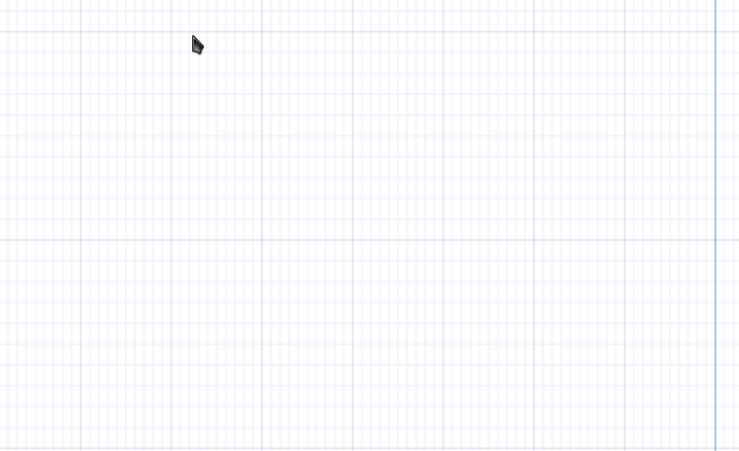
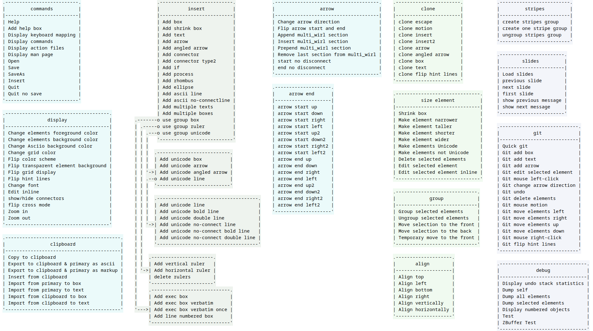

# Bindings

Both GUI and TUI have vim-like bindings, the GUI has a few extra bindings that are usually found in GUI applications; bindings can be modified.

It's faster and easier to work with keyboard shortcuts than the mouse and the number of combination of mouse buttons * control-keys is very limited.

*Asciio* bindings are vim-like, they initially take more time to get used to, and often take multiple key presses but they are much more logical as families of commands are
accessed with shortcuts that start with the same letter.

The bindings can be changed in your user configuration, See configuration/user_bindings 

# Bindings help

***Binding:*** zb



You can get a pop up showing the bindings (*?* in the top level) Or you can configure it:

```
USE_BINDINGS_COMPLETION => 1,
```

## Bindings map

*bindings change truth is in the config not this snapshot*



