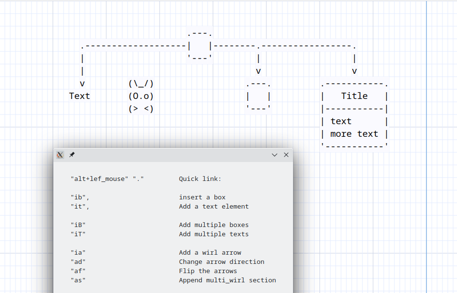

# GUI





```
          .-------------------------------------------------------------.
          | ........................................................... |
          | ..........-------------..------------..--------------...... |
          | .........| stencils  > || asciio   > || box          |..... |
          | .........| Rulers    > || computer > || text         |..... |
          | .........| File      > || people   > || wirl_arrow   |..... |
     grid----->......'-------------'| divers   > || axis         |..... |
          | ..................^.....'------------'| ...          |..... |
          | ..................|...................'--------------'..... |
          | ..................|........................................ |
          '-------------------|-----------------------------------------'
                              |
               context menu access some commands
               most are accessed through the keyboard

```

