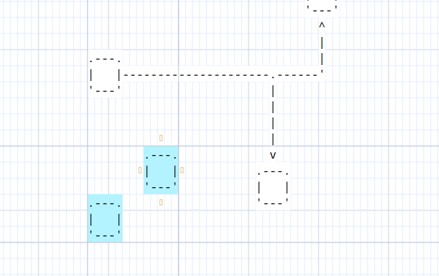
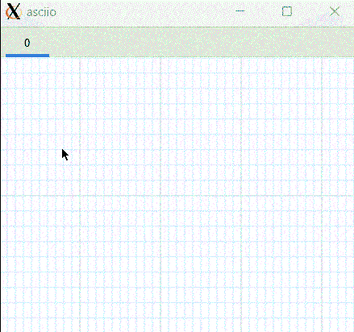

# GUI


```
          .-------------------------------------------------------------.
          | ........................................................... |
          | ..........-------------..------------..--------------...... |
          | .........| stencils  > || asciio   > || box          |..... |
          | .........| Rulers    > || computer > || text         |..... |
          | .........| File      > || people   > || wirl_arrow   |..... |
     grid----->......'-------------'| divers   > || axis         |..... |
          | ..................^.....'------------'| ...          |..... |
          | ..................|...................'--------------'..... |
          | ..................|........................................ |
          '-------------------|-----------------------------------------'
                              |
               context menu access some commands
               most are accessed through the keyboard

```

## Grid

### Grid lines

### Grid color

### Grid background color

## Hint lines



## Rulers

## Night Colors

## Multi-tab page

The GUI port, an asciio source file can contain multiple tabs. Each tab can be
named and supported Create, copy, delete, display hidden Labels and other
operations.




