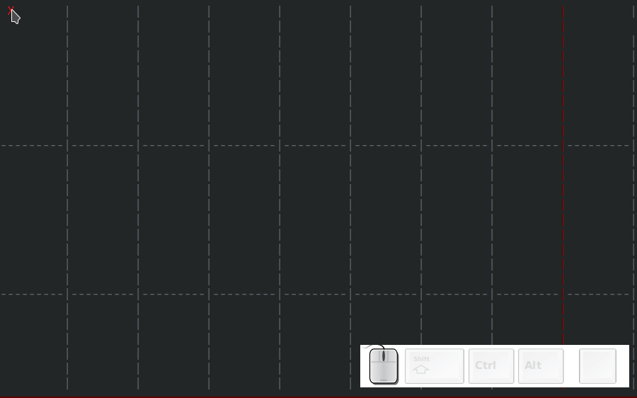

# TUI

The TUI interface is a work in progress. Drawing graphs in a terminal (without mouse) is more difficult than it seem, I'm actively working on creating better bindings to make as smooth as when using a mouse.

- mouse emulation
- differences
	- dialogs
	- manpage

## Asciio TUI and Vim

You can call Asciio from vim and insert your diagram.

        map  <leader><leader>a :call TAsciio()<cr>

        function! TAsciio()
            let line = getline('.')

            let tempn = tempname()
            let tempnt = tempn . '.txt'
            let temp = shellescape(tempn)
            let tempt = shellescape(tempnt)

            exec "normal i Asciio_file:" . tempn . "\<Esc>"

            if ! has("gui_running")
            exec "silent !mkdir -p $(dirname " . temp . ")" 
            exec "silent !cp ~/.config/Asciio/templates/empty.asciio ". temp . "; tasciio " . temp . "; asciio_to_text " . temp . " >" . tempt 
            exec "read " . tempnt
            endif

            redraw!
        endfunction

