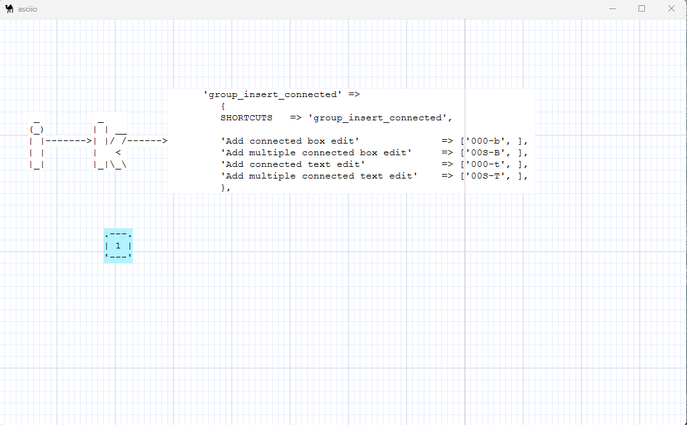
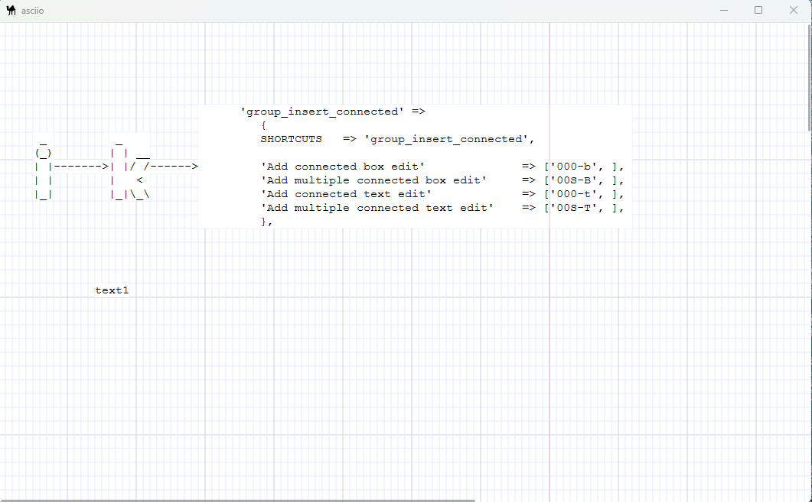

## Insert Connected

**Navigation:** [Index](bindings_index.md) > [Insert](insert_operation.md) > Connected

**Prefix:** Press `«i»` `«k»`

Starting from a box or text, element, automatically link to one or more new boxes or text.

### Connected Element Operations

| Operation                         | Binding   | Description                                      |
| --------------------------------- | --------- | -------------                                    |
| Add connected box edit            | `«b»`     | Insert box with immediate edit and auto-connect  |
| Add multiple connected box edit   | `«B»`     | Insert multiple boxes with edit and auto-connect |
| Add connected text edit           | `«t»`     | Insert text with immediate edit and auto-connect |
| Add multiple connected text edit  | `«T»`     | Insert multiple texts with edit and auto-connect |

