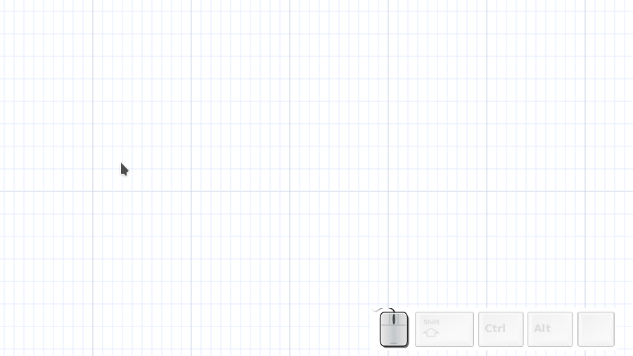

# Capturing groups with overlay



## Define  overlays

```perl
my $click_choice_element = ['Asciio/box', 0] ;
my $box_overlay =
	[
	[0, 0, '.'],
	[1, 0, '-'],
	[2, 0, '-'],
	[3, 0, '-'],
	[4, 0, '.'],
	
	[0, 1, '|'],
	[4, 1, '|'],
	
	[0, 2, "'"],
	[1, 2, '-'],
	[2, 2, '-'],
	[3, 2, '-'],
	[4, 2, "'"],
	] ;

my $text_overlay =
	[
	[0, 0, 'T.'],
	[1, 0, 'e'],
	[2, 0, 'x'],
	[3, 0, 't'],
	] ;

my $arrow_overlay =
	[
	[2, -2, '.'],
	[3, -2, '-'],
	[1, -1, '/'],
	[0, 0,  "'"],
	] ;

```

## Declare callbacks

```perl
my $click_element_overlay = $box_overlay ;

sub click_choice_add_element { App::Asciio::Actions::Elements::add_element($_[0], $click_choice_element) ; }

sub click_element_choice
{
my ($asciio, $args) = @_ ;
($click_element_overlay, $click_choice_element) = $args->@* ;
$asciio->update_display ;
}

sub click_element_enter { print "enter!!\n" ; my ($asciio) = @_ ; $asciio->set_overlays_sub(\&click_element_overlay) ; $asciio->update_display ; }
sub click_element_escape { my ($asciio) = @_ ; $asciio->set_overlays_sub(undef) ; $asciio->update_display ; }

sub click_element_mouse_motion 
{
my ($asciio, $event) = @_ ;

App::Asciio::Actions::Mouse::mouse_motion($asciio, $event) ;
$asciio->update_display() ; 
}

sub click_element_overlay
{
my ($asciio) = @_ ;
my @overlays = map { [ $asciio->{MOUSE_X} + $_->[0], $asciio->{MOUSE_Y} + $_->[1], $_->[2] ] } @$click_element_overlay ;

@overlays
}
```

## Declare bindings

```perl

register_action_handlers
(
'insert on click' =>
	{
	SHORTCUTS => '0A0-i',
	ENTER_GROUP => \&click_element_enter,
	ESCAPE_KEY => '000-Escape',
	
	'click element escape'  => [ '000-Escape',          \&click_element_escape                                               ],
	'click element motion'  => [ '000-motion_notify',   \&click_element_mouse_motion                                         ], 
	
	'click element insert'  => [ '000-button-press-1',  \&click_choice_add_element                                           ],
	'click element arrow'   => [ '000-a',               \&click_element_choice, [$arrow_overlay, ['Asciio/angled_arrow', 0]] ],
	'click element box'     => [ '000-b',               \&click_element_choice, [$box_overlay,   ['Asciio/box', 0]]          ],
	'click element text'    => [ '000-t',               \&click_element_choice, [$text_overlay,  ['Asciio/text', 0]]         ],
	
	},
) ;
```

