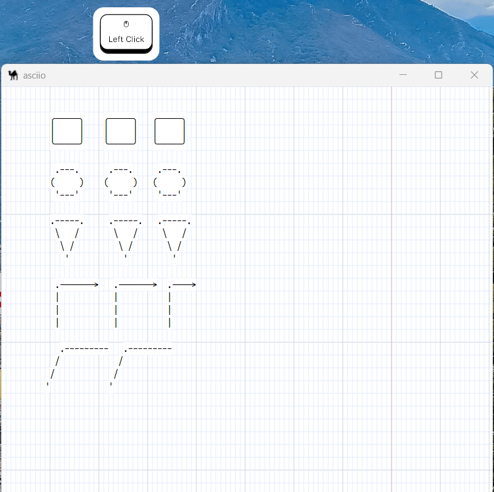
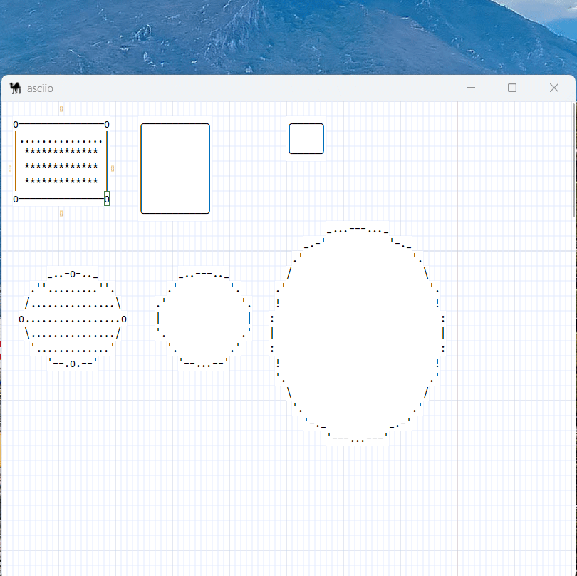

# Change element type

## Change element type via right mouse button in GUI

This is the most basic method and the slowest, and only works on the `GUI` port,
and this operation can only change the type of at most one element at a time.
as shown below.

## Use keyboard shortcuts to change element types after selecting multiple elements

***Binding:*** «e»

After pressing `«e»` to enter the element operation group, if you open the binding
key prompt(`«zb»`), you can see the element type change operation group. The
biggest advantage of this method is that the types of multiple elements of the
same type can be modified at one time.The following is an example:

## Copy the type of one element and apply it to multiple other elements

***Binding:*** «e»

Also under the element operation group, there are two operations:

1. Copy the type from an element.
2. Apply the type to multiple other elements.

It is similar to the format brush function in many software.

This feature is very useful for applying user-defined types to other elements.
Here's an example:

