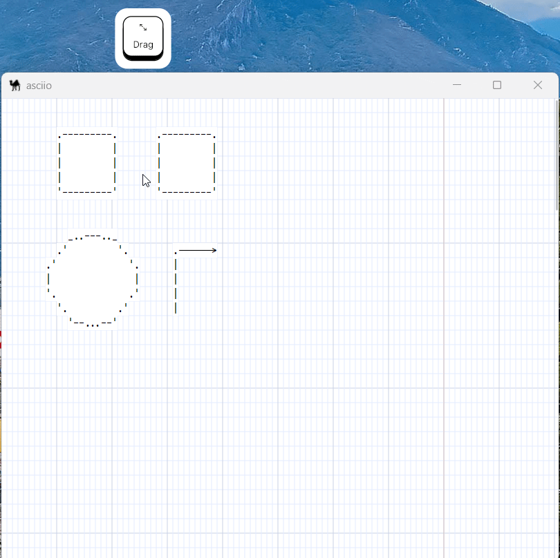

# Changing element attributes

Element attributes control how  elements are rendered. 

Example attributes:
- character to use to draw a box
- ASCII or Unicode characters
- filled shapes or not
- ...

## Using the context menu in the GUI

Only one element attributes can be changed.

## Using the keyboard bindings

Multiple elements can be selected and modified.

***Binding:*** 

    - «e»     enters the element operation group
    - «?»     sub group for the element you want to change

## Copy-Paste attributes to other elements

Also under the element operation group, there are two operations:

### Copy the attributes from an element

Select one element then :

***Binding:***

    - «e»     enters the element operation group
    - «c»     copy the attributes

### Paste the attributes

Select one or more element then :

***Binding:***

    - «e»     enters the element operation group
    - «p»     paste the attributes

### Paste the control attributes

Select one or more element then :

***Binding:***

    - «e»       enters the element operation group
    - «Shift+P» paste the control attributes

The control attributes of the element are as follows:

    - AUTOCONNECT_DISABLED
    - OPTIMIZE_DISABLED
    - CROSSOVER_DISABLED
    - NOT_CONNECTABLE_START
    - NOT_CONNECTABLE_END
    - ALLOW_BORDER_CONNECTION
    - AUTO_SHRINK
    - RESIZABLE
    - EDITABLE

