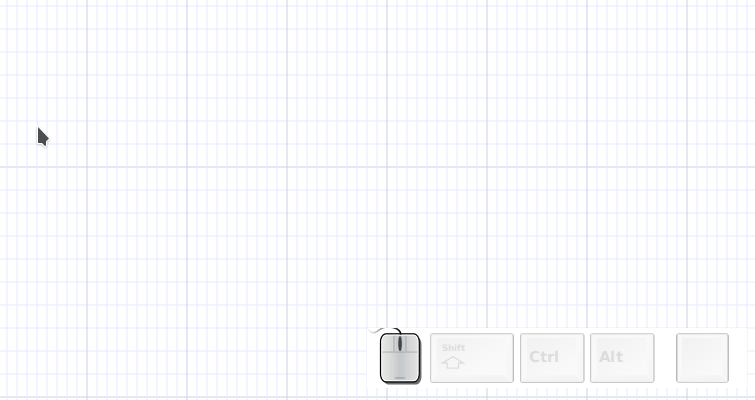

# Mouse

## Quick link

***Binding:*** «alt-left-mouse-click»

- create a box is nothing is selected
- if only a box is selected, create a new box and connect to it
- if a box is selected amd mouse over a box, connect them
- if multiple boxes are selectted, create a box and connect to all boxes

## Quick copy

***Binding:*** «alt-shift-left-mouse-click»

Copy the current selection and move it to another position, see ***cloning***

## Quick arrow

***Binding:*** «ctl-alt-mouse-motion»

If an arrow is selected, move its end point with the mouse.

## Quick section

***Binding:*** «ctl-alt-left-mouse-click»

- If a wirl arrow is selected, add section.
- if another element is selected, add new arror

You can then move the its end point with the mouse. releasing «ctl» lets you move the mouse to another position for a new section.

## Quick box and section

You can quickly create boxes and section by combining ***quick link*** and ***quick section***.

- «alt-left-mouse-click», create a box
- «ctl-alt-left-mouse-click», link the box to a new arrow
- move mouse
- «ctl-alt-left-mouse-click», add a section
- move mouse
- «ctl-alt-left-mouse-click», add a section
- move mouse
- «alt-left-mouse-click», connect last section to new box

