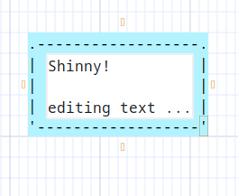

# Editing elements text and attributes

Asciio  has two editing mode, *Dialog* and *Inline*, the default mode is *Dialog*.

## Dialog editing

Binding: Return, double-click

Asciio opens a dialog which lets you set:
- boxing options
- title
- text


## Inline editing

Binding: Return, double-click

In this mode you can only edit the text.



## Alternate editing

You can edit in the other mode with these bindings:

- ctl + Return
- ctl + double-click

## Changing mode

To change the mode during the session use:

Binding: «zi»

## Setting the editing mode in the user configuration

```perl
EDIT_TEXT_INLINE => 0,
```
- `EDIT_TEXT_INLINE => 0` Indicates that the default editing mode is `Dialog editing`
- `EDIT_TEXT_INLINE => 1` Indicates that the default editing mode is `Inline editing`
 

