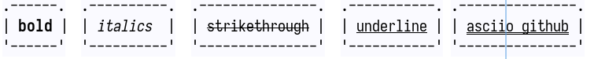
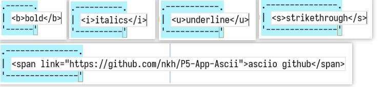
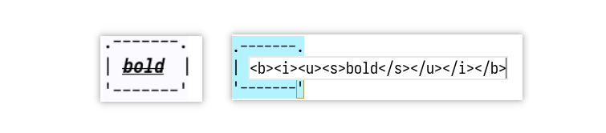

# Markup mode

We can use color in asciio, But if exported, the color information will be lost.
The markup mode adds marks in the chart, and these marks can be retained when 
exporting, so that special effects can be displayed in some specific software.

## Use markup mode

To use marks in the chart, turn on this option in the configuration.The markup 
enable variable is the basic attribute of the chart and cannot be changed at 
runtime.


```perl
USE_MARKUP_MODE => 'zimwiki',
```

If you do not need to use any markup mode, please keep this variable empty.

```perl
USE_MARKUP_MODE => '',
```
>Currently, only zimwiki format markup is supported, then markdown format or pure
html format may be supported in the future.

## zimwiki format description
### Edit marks

zimwiki markup mode currently supports text editing of box type elements.Just place the text 
in the middle of the marks.

Currently supports 5 types of markers: 
- bold
  - `<b>`something`</b>`
- underline
  - `<u>`something`</u>`
- double underline
  - `<span link="https://github.com/nkh/P5-App-Asciio">`link name`</span>`
- strikethrough
  - `<s>`something`</s>`
- italics
  - `<i>`something`</i>`


***This is what it looks like in Asciio:***



***This is the effect in inline editing mode:***



Marks can only be valid for a single line, not multi lines.

***Marks support nesting:***



>Although this function is supported, it is not recommended to use it in this way, 
and it does not make much sense


### Export

Normally, when exporting to ascii, you will get the following text

***Binding:*** «ctl-e» «shift-Y» «Y»


```
                          .----------.  .---------------.  .-----------. .---------------.
                          | italics  |  | strikethrough |  | underline | | asciio github |
                          '----------'  '---------------'  '-----------' '---------------'
```

Currently, an export format is also supported, and the mark up character is added, which 
can be recognized by [zim](https://zim-wiki.org/).

***Binding:*** «ctl-shift-E»

```
                          .----------.  .---------------.  .-----------.
                          | //italics//  |  | ~~strikethrough~~ |  | __underline__ |
                          '----------'  '---------------'  '-----------'
```

In the zim environment, they will be rendered like this:


