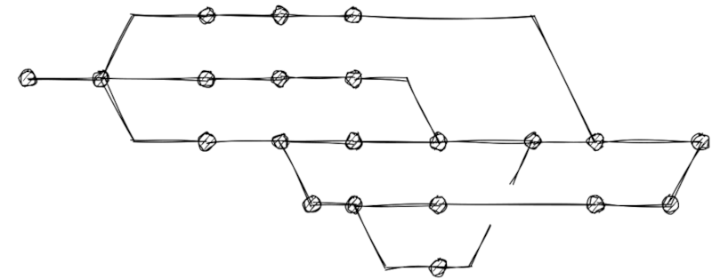

# SVG

Asciio doesn't export directly to SVG but uses a text to SVG application like Goat or SvgBob.

## Create a diagram in Asciio

## Export it to SVG

## Further process the SVG

I used [fskpf](https://fskpf.github.io/) web site to generate a pseudo hand-drawn graph out of it

The *svg2roughj* sproject is here

