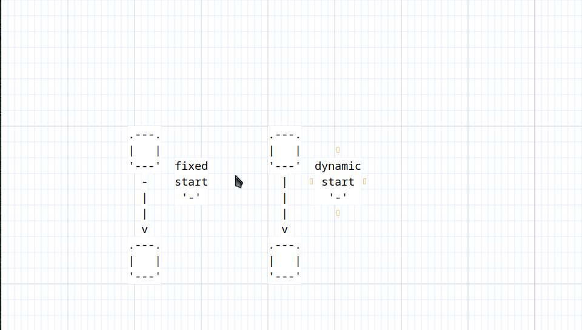

# Fixed vs Dynamic Connectors

Fixed connectors remain the same regardless of arrow direction while dynamic connectors change according to the arrow direction

## Example: Bindings for Both Connectors Fixed

**Navigation:** [Index](bindings_index.md) > [Arrow Operations](arrow_operation.md) > [Connectors](bindings_group_arrow_connectors.md) > [Both_connectors](bindings_group_arrow_connectors_both.md) > Fixed

**Prefix:** Press `«a» `«c»` `«b»` `«f»` to enter this group

**Exit:** Press `«Escape»` to return to both connectors configuration

## Fixed Connector Styles

| Operation                 | Binding     | Description                       |
| -----------               | ---------   | -------------                     |
| Dash fixed (both)         | `«-»`       | Use dash (-) at both ends         |
| Dot fixed (both)          | `«.»`       | Use dot (.) at both ends          |
| Star fixed (both)         | `«Shift+*»` | Use star (\*) at both ends        |
| Circle fixed small (both) | `«o»`       | Use small circle (o) at both ends |
| Circle fixed large (both) | `«Shift+O»` | Use large circle (O) at both ends |
| Bullet fixed (both)       | `«d»`       | Use bullet (•) at both ends       |

The same bindings exist when changing the start or the end connector.
