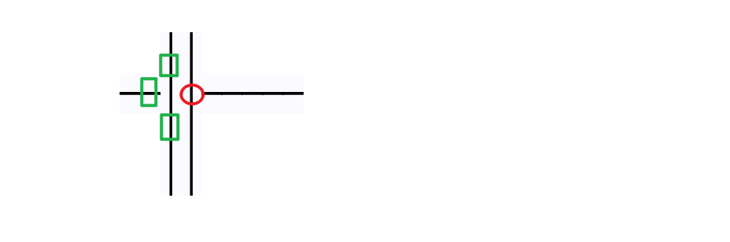

# Basic introduction

When the borders of two text elements intersect, we generate some 
compensating characters to cover the borders, resulting in nicer graphics

```
          |            ││    │  │
          |            ││    │  │
     -----|--->      ──││────│──│─
          |            ││    │  │
          |            ││    │  │
          v
```
Look at the text above, their borders are overlapping each other.
The text we need to generate is as follows:

```
          |            ││    │  │
          |            ││    │  │
     -----+--->      ──┼┼────┼──┼─
          |            ││    │  │
          |            ││    │  │
          v

```

We need to generate padding characters at their boundaries, 
then the steps are as follows:

1. find the cross point.
2. Determine the characters to be filled at the current cross 
   point according to the characters around the cross point.
3. Determine whether the current cross point has the 
   expected fill character, if so, keep it, if not, add it, 
   and delete the old fill character.
4. remove all filling characters that are not at cross points.
5. update drawing.

# Detailed steps
## Find the cross point

The cross point must be the coverage of characters, 
and the characters that cover each other are the characters we care about.
>The characters we care about refer to commonly used tab characters, 
or ascii plus dots, etc.

Commonly used symbols include these, of course not only these
```
'-', '|', '.', '\'', '\\', '/', '+', 
'─', '│', '┼', '┤', '├', '┬', '┴', '╭', '╮', '╯', '╰',
'━', '┃', '╋', '┫', '┣', '┳', '┻', '┏', '┓', '┛', '┗', 
'═', '║', '╬', '╣', '╠', '╦', '╩', '╔', '╗', '╝', '╚',
'╫', '╪', '╨', '╧', '╥', '╤', '╢', '╡', '╟', '╞', '╜', 
'╛', '╙', '╘', '╖', '╕', '╓', '╒'
```

**condition of cross points:**
1. text elements crossed
2. The two characters that intersect each other 
   are the characters we care about

When the condition is found to be met, both characters need to be logged.
At the same time, we need to record the characters around the cross point, 
because they absolutely determine what kind of cross point is generated.
>Record the upper, lower, left, and right characters. If you want to achieve 
diagonal crossing, you also need to record characters at 45 degrees, 
135 degrees, 225 degrees, and 315 degrees.

## Judgment scene

### General situation

First of all, all cross characters are directional, we need to group 
them by direction and type.

Let me give you an example, if the center has generated a character`┼`,
Then we can use the method of proof by contradiction, its left side 
must be these characters, otherwise it is unreasonable.

```
'─',    '┼',    '├',    '┬',    '┴',    '╭',    '╰'
```
These characters all can appear to the left of it(Because their right sides 
can be extended to become a line), But if these characters do not appear on 
the left side of `┼`, then we think it is unreasonable to use this `┼`, and 
the disproof condition is false.
> 

```
'-', '|', '.', '\'', '\\', '/', '+', 
'─', '│', '┼', '┤', '├', '┬', '┴', '╭', '╮', '╯', '╰',
'━', '┃', '╋', '┫', '┣', '┳', '┻', '┏', '┓', '┛', '┗', 
'═', '║', '╬', '╣', '╠', '╦', '╩', '╔', '╗', '╝', '╚',
'╫', '╪', '╨', '╧', '╥', '╤', '╢', '╡', '╟', '╞', '╜', 
'╛', '╙', '╘', '╖', '╕', '╓', '╒'
```
Make assumptions about the occurrence of each possible padding crossing 
character above, untilSupposed to be true.

```
                             │
                           ──│──
                             │

```

For the plus sign, the condition for its appearance is that:
1. A character in the upper character set appears in the upper direction
2. A character in the down direction character set appears in the down direction
3. A character in the left-direction character set appears in the left direction
4. A character in the right-direction character set appears in the right direction

If these conditions are met, the intermediate characters can be corrected as `┼`:

```
                             │
                           ──┼──
                             │

```

Let's look at a more complex situation, The intersection below, we know, needs 
one `╤` to fill.
```
  ═══│════
     │
     │
```
For the `╤` sign, the condition for its appearance is that:
1. Left is one of the left characters of the double-line character set
2. Right is one of the right characters of the double-line character set
3. Down is one of the down characters in the single-line character set
4. Up **cannot be** one of the up characters in the single-line character set

Pay attention to the bold part above, because if this condition is true, 
then the filling character should be `╪`, not `╤`.

### Improve efficiency

There is no need to perform calculations every time to determine the characters 
filled in the middle. Whenever a new scene calculation occurs, we can save the 
calculation result in a cache and read it directly next time without performing 
logical calculations again.

A hash table is most suitable for this, and the hash key can use a combination 
of upper, lower, left, and right characters(The oblique lines are the four diagonal 
directions.).

### An additional case needs to be considered separately

```
   ││
 ──││─────
   ││
   ││

```

please see this text, It is expected that we are going to get the following text:

```
   ││
 ──┼┼─────
   ││
   ││

```
As you noticed, there are two plus signs filled.

Let's take the point that needs to be filled on the left as an example:


We can see that characters in three directions meet the requirements, 
but characters in one direction **do not meet the requirements**.
But the point on the right is actually also an cross point, it has two 
characters, one in the foreground and one in the background. The character 
in the background is ok, so we think it ok!

**In summary:** If the character next to it is also an cross point, then 
either the foreground character or the background character of the 
intersection can meet the requirements.So I said earlier that the foreground 
and background characters of the cross point all need to be recorded.


### The case of character coverage

There is another situation that needs to be explained separately,Similar to 
above but slightly different

```
 ╭─────╮
 │ ╭─────╮
 │ │     │
 │ │     │
 ╰─│     │
   ╰─────╯

```
The text we need to get is this:

```
 ╭─────╮
 │ ╭───┴─╮
 │ │     │
 │ │     │
 ╰─┤     │
   ╰─────╯

```
This looks like two boxes stacked,According to the above statement, 
the overlapping parts, both foreground characters and background characters 
must be considered.**But not like this!**The overlapping foreground characters 
are spaces, and spaces are not characters in the character set, so they are 
not considered.

**To put it simply:** as long as it is not an cross point, only foreground 
characters are considered.

>The definition of the cross point has already been mentioned in the 
previous chapter


