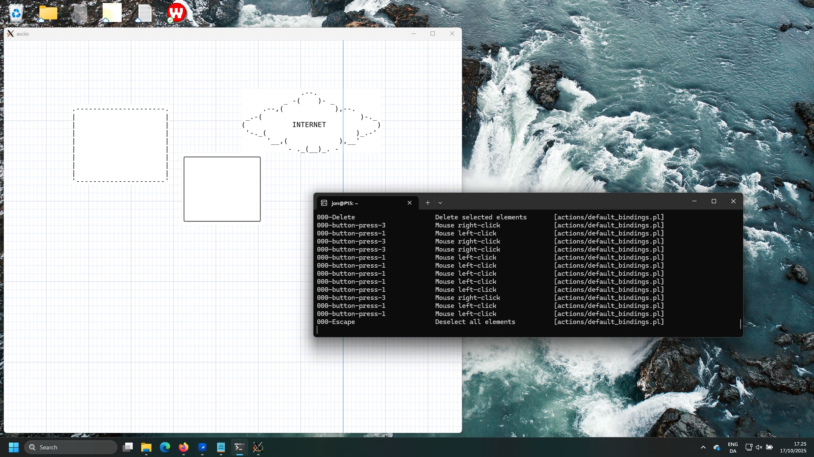

# Running asciio

    $> asciio [file.asciio]       # GUI application using Gtk3

    $> tasciio [file.asciio]      # TUI application

    $> asciio_to_text file.asciio # converts asciio files to ASCII

    $> text_to_asciio ...         # makes an asciio file from text


# Command line options

| option                    |                                            |                |
| -                         | -                                          | -              |
| b                         | put the input in a box element             | text_to_asciio |
| text_separator=s          | put the input in a boxed element           | text_to_ascioo |
| display_setup_information | verbose setup information                  |                |
| setup_path=s              | sets the root of the setup directory       |                |
| s,script=s                | script to be run at Asciio start           |                |
| p,web_port=s              | port for web server                        |                |
| debug_fd=i                | debug file descriptor number               |                |
| add_binding=s             | file containing bindings to embedd         |                |
| reset_bindings            | remove all embedded bindings from document |                |
| dump_bindings             | write the embedded bindings to files       |                |
| dump_binding_names        | display name of embbeded bindings          |                |

# Platforms

Asciio is developed on both Linux and Windows (cygwin).

# Installation

asciio's is hosted on  [github](https://github.com/nkh/P5-App-Asciio)

## Debian/Ubuntu package

No packages pre-build for distributions yet, work is ongoing.

## Manual install on debian based distros. 

See the OCI build instruction in [Containerfile](https://github.com/nkh/P5-App-Asciio/blob/main/OCI/Containerfile).

## OCI image

### user config

A user configuration is copied from 'repo:OCI/Asciio' to '/root/.config/Asciio/', it can be modified to suit your needs.

### pre-built image

The image is on [github](https://github.com/users/nkh/packages/container/package/p5-app-asciio)

Change <PATH_YOU_WANT_TO_SHARE>, if you want to save your files to your file system, before running the command below.

### linux

```bash
podman run -it --net=host --env="DISPLAY" --volume="$HOME/.Xauthority:/root/.Xauthority:rw" --volume="$HOME:<PATH_YOU_WANT_TO_SHARE>" ghcr.io/nkh/p5-app-asciio:release asciio

```
### Jypiter notebook

Example of installation and testing.

[](https://colab.research.google.com/github/nkh/P5-App-Asciio/blob/main/examples/asciio.ipynb)

### windows wsl

If using Podman, add github repository to podman in '/etc/containers/registries.conf'

```
[registries.search]
registries = ['ghcr.io']
```

Install an Xserver in windows. I used [VcXsrv](https://vcxsrv.com/) and disabled access control.

The IP of Xserv was not correct. Had to use this, to have it report the Windows host virtual IP: 
```
export DISPLAY=$(ip route | grep default | awk '{print $3}'):0
```

```bash
podman run -it --net=host --env="DISPLAY" --volume="$HOME:<PATH_YOU_WANT_TO_SHARE>" p5-app-asciio:release asciio

```





## Windows

In the windows environment, you can use asciio through msys2 or WSL or cygwin.

### windows msys2 package

[P5-App-Asciio-msys2](https://github.com/qindapao/P5-App-Asciio-msys2), Here are the complete packaging and installation instructions.

### WSL

The use of WSL is not much different from the Linux environment.However, there are some things that need attention. This link talks about how to connect to the WSL environment and execute GUI programs through remote connections under Windows.

[remote_wsl_use_gui_app](https://github.com/qindapao/linux_app_use_in_windows/blob/main/remote_wsl_use_gui_app.md)

### Cygwin

- First install [Cygwin](https://www.cygwin.com/).
- Make sure the following components are installed correctly
   - x11
   - perl
   - Gnome
   - gun-make
   - gcc-g++
- Search for "gcrypt" in all the packages to be installed, and install all 
  the packages that appear.
- Install all dependent modules of asciio

Pay attention when installing perl modules, some may be installed through 
cpan, but some cannot, and can only be installed manually.

>When compiling, the Makefile of several modules has an unrecognized option 
`-lnsl`. removed it when install it manually.

Start asciio by the following method:

```bash
startxwin >/dev/null 2>&1 &
export DISPLAY=:0.0
asciio
```

