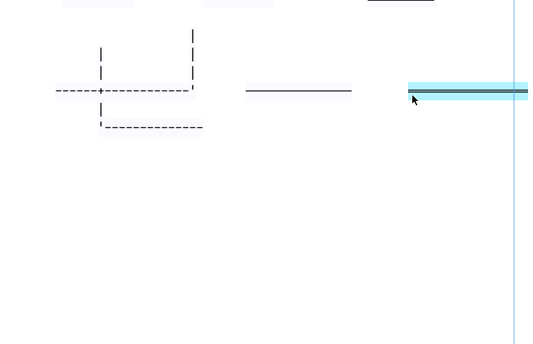

# Cross Mode

## Introduction

In normal mode, elements boundaries are independent of each.


In cross mode intersections are merged:


## Complex graphics

The cross-mode lets you create graphics like this table

```

        ╔═══════╤══════════════════════════════════════════════════════════════╗
        ║       │   test scores                                                ║
        ║       ├──────┬───────┬───────┬────────┬───────┬──────┬────────┬──────╢
        ║  Name │  Math│Physics│       │        │       │      │        │      ║
        ╟───────┼──────┼───────┼───────┼────────┼───────┼──────┼────────┼──────╢
        ║ Jim   │  A+  │  B    │       │        │       │      │        │      ║
        ╟───────┼──────┼───────┼───────┼────────┼───────┼──────┼────────┼──────╢
        ║Stephen│  B   │  A    │       │        │       │      │        │      ║
        ╟───────┼──────┼───────┼───────┼────────┼───────┼──────┼────────┼──────╢
        ║ Kate  │  A   │  C    │       │        │       │      │        │      ║
        ╚═══════╧══════╧═══════╧═══════╧════════╧═══════╧══════╧════════╧══════╝

```

## Enabling cross-mode

### Globally

Add this line in your user configuration.

```perl
CROSS_MODE => 1,
```

In the GUI, open the file and enable cross mode, the cross mode title will be displayed at the top


### Dynamically

Binding: «Alt-x» 'Switch cross mode'

## Cross-mode elements

Only elements marked as cross-mode elements will have their intersections patched.


```
«x» Cross-mode bindings:

«b»                Add cross box

«e»                Add cross exec box

«a»                Add cross arrow

«A»                Add cross angled arrow

«w»                add cross ascii line

«W»                add cross unicode line

«C-w»              Add cross unicode bold line

«A-w»              Add cross unicode double line

```

The cross-mode elements background is displayed in a different color.

## Cross-mode lines vs Normal lines



## Line and Box


## Lines and boxes and lines 


## Exported to text

```
                
                        ╒═════════════════╗
                        │   ══════════════╬══╗
                   ╭────┼──╮              ║  ║     ═════════════════╗
                   │    │  │                 ║                      ║
                   │    │  │                                        ║
                   │    │  │                      ━━━━━━━━━━━┓      ║
                   ╰────┼──╯                    ━━━━━━━━━━━━━╋━━━━  ║
                        │                                    ┃      ║
                        │    │    │    │       │     │       ┃      ║
                        │    ├────┼────┼───────┼─────┼──     ┃      ║
                        │    │    │    │       │     │       ┃      ║
                             │    │    │       │     │       ┃      ║
                                         ━━━━━━━━━━━━━━━━━━━━╋━━    ║
                                                             ┃
                                                     ╔═══════╗
                     ╭───────╮                       ║       ║
                     │  ╭────┴──╮                    ║       ║
                     │  │       │                    ║       ║
                     │  │       │                    ╚═══════╝
                     ╰──┤       │
                        ╰───────╯                              ╔═══════╗
                                                               ║       ║
                                                            ╔══╩════╗  ║
                                                            ║       ║  ║
                         ┏━━━━━━━┓     ╔═══════╗            ║       ╠══╝
                         ┃       ┃     ║       ║            ║       ║
                         ┃       ┃     ║       ║            ╚═══════╝
                         ┃       ┃     ║       ║
                         ┗━━━━━━━┛     ╚═══════╝
                
```

## Conversion between ordinary elements and cross-mode elements

You can convert non cross-mode elements into cross-mode elements and vice versa. If no elements are selected, all the elements are transformed.

```
«x» Cross-mode group:

«C-c»                change to cross elements

«C-n»                change to normal elements

```

## cross-mode fillers

Borders are filled with a special element, which can't be edited but can be deleted. They are colored differently.

The bindings below allow you to select different types of elements.


```
«x» Cross group:

«c»                Select cross elements

«f»                Select cross fillers

«n»                Select normal elements

«A-f»              Select normal fillers

```

There are four types of elements in cross-mode:

- cross elements, elements that participate in cross behavior in crossi-mode.
- cross fillers, special elements that repair the borders of crossed elements
- normal elements, no matter in what mode, they are not ahandled by the cross-mode
- normal fillers, the result of a cross fillers after it is transformed into a normal element

## Performance

The cross-mode is resource intensive and can make large diagrams lag. Asciio has special group named, strip-group; when placed in a strip-group elements are "frozen" and will take much less resources. If you are done with designing an object with cross-elements, place it in a strip-group, you can reverse the operation if needed. 

