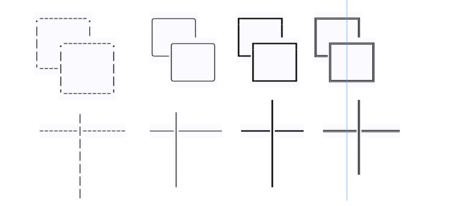
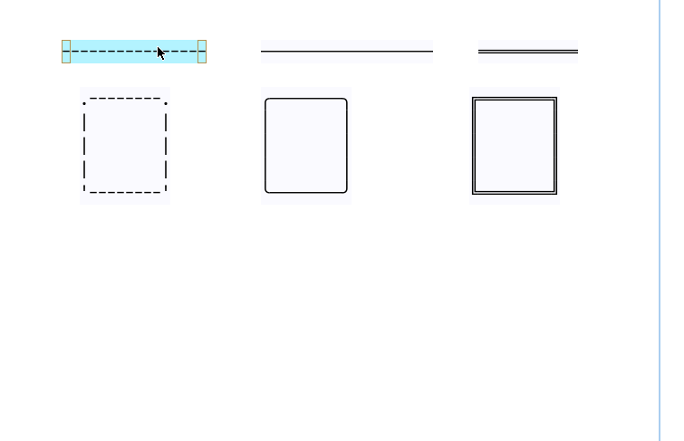

# Cross Mode

## 1 Introduction

In normal mode, elements boundaries are independent of each.



In cross mode intersections are merged:


## 2 Complex graphics

The cross-mode lets you create graphics like this table

```

        ╔═══════╤══════════════════════════════════════════════════════════════╗
        ║       │   test scores                                                ║
        ║       ├──────┬───────┬───────┬────────┬───────┬──────┬────────┬──────╢
        ║  Name │  Math│Physics│       │        │       │      │        │      ║
        ╟───────┼──────┼───────┼───────┼────────┼───────┼──────┼────────┼──────╢
        ║ Jim   │  A+  │  B    │       │        │       │      │        │      ║
        ╟───────┼──────┼───────┼───────┼────────┼───────┼──────┼────────┼──────╢
        ║Stephen│  B   │  A    │       │        │       │      │        │      ║
        ╟───────┼──────┼───────┼───────┼────────┼───────┼──────┼────────┼──────╢
        ║ Kate  │  A   │  C    │       │        │       │      │        │      ║
        ╚═══════╧══════╧═══════╧═══════╧════════╧═══════╧══════╧════════╧══════╝

```

## 3 Enabling cross-mode

### 3.1 Globally

Add this line in your user configuration.

```perl
USE_CROSS_MODE => 1,
```

### 3.2 Dynamically

Binding: «z-x» 'Switch cross mode'

## 4 Line and Box


## 5 Lines and boxes




## 6 Exported to text

```
        .--------.      ╭────────╮    ┏━━━━━━━━┓    ╔════════╗
        |        |      │        │    ┃        ┃    ║        ║
        |        |      │        │    ┃  ┏━━━━━┻━━┓ ║        ║
        |        |      │        │    ┃  ┃        ┃ ║        ║
        '--------'      ╰────────╯    ┗━━┫        ┃ ╚════════╝
                                         ┃        ┃
                                         ┗━━━━━━━━┛

                |               │            ┃           ║
                |               │            ┃           ║
                |               │            ┃           ║
                |               │       ━━━━━╋━━━━━━     ║
                |               │            ┃           ║
                |               │            ┃           ║
                |               │            ┃           ║
                |               │            ┃           ║
                |               │            ┃           ║


                .--------.
                |        |          ╭─┬────────┬─────╮
                |  .-----'--.       │ │        │     │
                |  |        |       │ │        │     │
                '--.        |       │ │        │     │    ╔══════════════╗
                   |        |       │ ╰────────╯     │    ║              ║
                   '--------'       │                │    ║              ║
                                    │                │    ║              ║
                                    │        ╔═══════╧╗   ║              ║
                                    │        ║        ║   ║              ║
                                    ╰────────╢        ║   ║              ║
                                             ║        ║   ║              ║
                                             ╚════════╝   ╚══════════════╝

```


