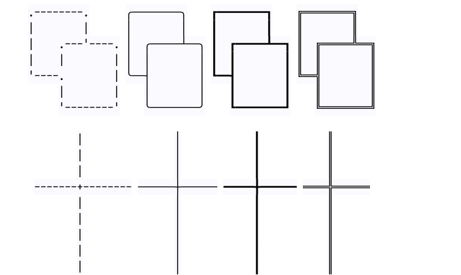

# Cross

## Introduction

In the general case, where elements intersect elements, 
their boundaries are independent of each other.


But the cross mode can make their borders be automatically patched, and you will see a graph like this:



Notice the difference? Their intersections are automatically filled.

## Scenes to be used

Cross mode can be used to generate some complex and beautiful tables,
or other complex graphics.
```
                       ╔═══════╤══════════════════════════════════════════════════════════════╗
                       ║       │   test scores                                                ║
                       ║       ├──────┬───────┬───────┬────────┬───────┬──────┬────────┬──────╢
                       ║  Name │  Math│Physics│       │        │       │      │        │      ║
                       ╟───────┼──────┼───────┼───────┼────────┼───────┼──────┼────────┼──────╢
                       ║ Jim   │  A+  │  B    │       │        │       │      │        │      ║
                       ╟───────┼──────┼───────┼───────┼────────┼───────┼──────┼────────┼──────╢
                       ║Stephen│  B   │  A    │       │        │       │      │        │      ║
                       ╟───────┼──────┼───────┼───────┼────────┼───────┼──────┼────────┼──────╢
                       ║ Kate  │  A   │  C    │       │        │       │      │        │      ║
                       ╚═══════╧══════╧═══════╧═══════╧════════╧═══════╧══════╧════════╧══════╝

```

## Basic operation

**Two conditions** need to be met to use cross mode:

1. You have enabled the cross mode globally, the user configuration is here:
```perl
CROSS_MODE => 1,
```
The value set to 1 means to turn on corss mode, When you open an asciio file, there will also be a prompt in the title bar.


If your configuration file is not opened by default, you can also open it during use, the following is the shortcut key for switching

    «A-s» 'Switch cross mode'
>Switching means: if you are in cross mode then press to exit; 
if not in cross mode then press to enter.
2. You need to use the **cross elements** for the intersection 
   behavior to occur. Ordinary elements will not work, The following 
   is the shortcut key for inserting cross elements


```
    «x» Cross group:

        «b»                Add cross box

        «e»                Add cross exec box

        «a»                Add cross arrow

        «A»                Add cross angled arrow

        «w»                add cross ascii line

        «W»                add cross unicode line
        
        «C-w»              Add cross unicode bold line

        «A-w»              Add cross unicode double line
```

cIn the GUI interface, the background color of the cross 
elements is darker. Through the following two gifs, you can see the difference between cross elements and ordinary elements


This is the text exported by cross mode:

```
              This side is the cross elements

        ╒═════════════════╗
        │   ══════════════╬══╗
   ╭────┼──╮              ║  ║     ═════════════════╗
   │    │  │                 ║                      ║
   │    │  │                                        ║
   │    │  │                      ━━━━━━━━━━━┓      ║
   ╰────┼──╯                    ━━━━━━━━━━━━━╋━━━━  ║
        │                                    ┃      ║
        │    │    │    │       │     │       ┃      ║
        │    ├────┼────┼───────┼─────┼──     ┃      ║
        │    │    │    │       │     │       ┃      ║
             │    │    │       │     │       ┃      ║
                         ━━━━━━━━━━━━━━━━━━━━╋━━    ║
                                             ┃
                                     ╔═══════╗
     ╭───────╮                       ║       ║
     │  ╭────┴──╮                    ║       ║
     │  │       │                    ║       ║
     │  │       │                    ╚═══════╝
     ╰──┤       │
        ╰───────╯                              ╔═══════╗
                                               ║       ║
                                            ╔══╩════╗  ║
                                            ║       ║  ║
         ┏━━━━━━━┓     ╔═══════╗            ║       ╠══╝
         ┃       ┃     ║       ║            ║       ║
         ┃       ┃     ║       ║            ╚═══════╝
         ┃       ┃     ║       ║
         ┗━━━━━━━┛     ╚═══════╝

```

**Slashes** can also cross, not used much.

## Advanced usage

### Cooperation with strip groups

If a certain part of the graphics has already been designed, 
there is no need to perform cross-action. We can use a strip 
group to protect this part. Just release it from the group 
when you need to edit it again.

Cross elements no longer have the cross attribute after being 
placed in a strip group until released.


Why do this?
>The crossover algorithm will increase the performance consumption,
and the performance of the chart will be improved after being converted 
to ordinary elements.

### Conversion between ordinary elements and cross elements

The shortcut keys below make cross elements and Ordinary elements convert to each other. Note that if no elements are selected, the transformation takes effect on all elements!

```
    «x» Cross group:

        «C-c»                change to cross elements

        «C-n»                change to normal elements

```


### About cross mode fillers

All borders are filled with a special element, they cannot be edited.
They are marked with a special color and can be deleted if not needed.
>When exiting the cross mode, the fillers will be retained, and after 
entering the cross mode, the fillers in the inappropriate position will 
be automatically deleted. So don't worry about them polluting your graph.

Of course you can also manage them manually, including cross elements 
and normal elements, cross fillers and normal fillers.


```
    «x» Cross group:

        «c»                Select cross elements

        «f»                Select cross fillers

        «n»                Select normal elements

        «A-f»              Select normal fillers
```
For cross mode, elements are divided into four categories:

- cross elements
  - Elements that participate in cross behavior in cross mode.
- cross fillers
  - Special elements that repair the borders of crossed elements in cross mode will be automatically generated and disappeared.
- normal elements
  - Ordinary elements, no matter in what mode, do not crossing.
- normal fillers
  - A special element after the cross fillers is transformed into a normal element, for easy removal and re-engagement in cross behavior.


The switching mentioned in the previous chapter is actually the 
following conversion of these four elements:

**1. change to cross elements**

`normal elements` convert to `cross elements`

`normal fillers` convert to `cross fillers`

**2. change to normal elements**

`cross elements` convert to `normal elements`

`cross fillers` convert to `normal fillers`


After exiting the cross mode, the cross will not happen 
automatically, and you can select and operate these four types of elements. 
If no elements are selected, the selection takes effect for all elements.


