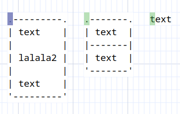

# Find

Asciio lets you search for text using regular expressions and navigate the matching elements list.

The find functionality is accessed with direct bindings or via a find mode which offers some extra functionality.

Matching elements will be have a color tag added, green for the matching elements and blueish for the current matching element.

- Direct operations

    - search for text
    - navigate matches
    - clear the search

- Find Mode operation

    - select matching elements
    - zoom the canvas.

***Bindings:***  [**«Find and Find modes»**](../find_mode.md)

## Demo

## Display Option

You can set **DISPLAY_MATCHING_STRIPE** in your configuration to display where the match is in an element (best effort).

