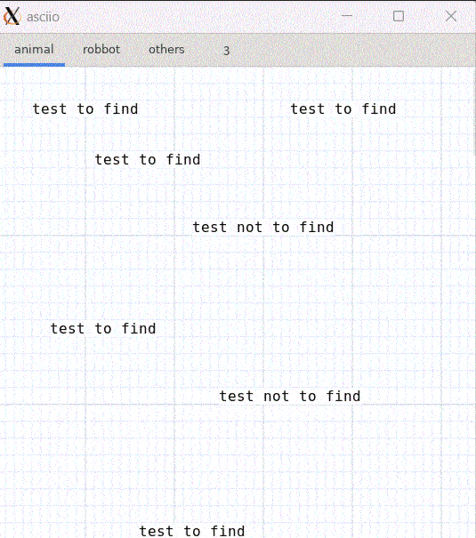

# find

## 1 Introduction

The find mode is mainly used to find the location where our target text appears
in all asciio objects, and can quickly locate those matching positions and
highlight them. This is a special feature on the GUI port.

## 2 Basic operations

### 2.1 Entering and exiting find mode

| action         | binding       |
|----------------|---------------|
| Enter find mode | `<<f>>`       |
| Exit find mode  | `<<Escape>>` |

When you enter the find mode, a dialog box will pop up to enter the content yo
need to search for. You can enter here Words, phrases, sentences, and even a
perl regular expression.

### 2.2 Operation after entering find mode

After entering the searched content, all the found content will be highlighted.
Press `n` to search forward, press `N` to search backward, it is a bit like
Content search in **VIM**. And all the tab pages found will be highlighted in
yellow. Click the tab page to switch to the corresponding one.  After switching
to a new tab, then press `f` key to enter the search mode before searching.

After the find mode exits, all highlights will not disappear, which can more
conveniently highlight what we need to see.

If these highlights interfere with you, you need to re-enter the find mode and
press the `c` key to clear the highlights. Highlighting is cleared by default
when the render cache is cleared.

In the find mode, you can use zooming, which is generally mapped to
`Ctrl+mouse wheel`. It is alse OK to use drag and drop.

Once the content is found, the content found will be automatically remembered,
and the content is also entered again (This is mainly to make it more convenient
to find the same content in multiple tabs). If you want to enable a new search,
you need to press `o` to clear the find content. Then again enter the find mode
to perform a new search.

