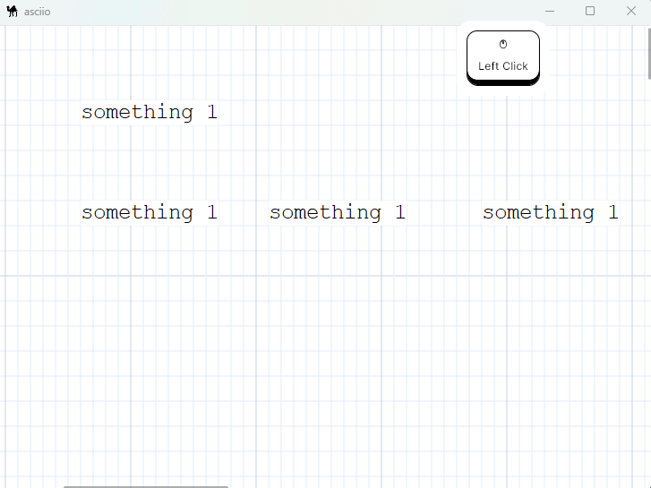
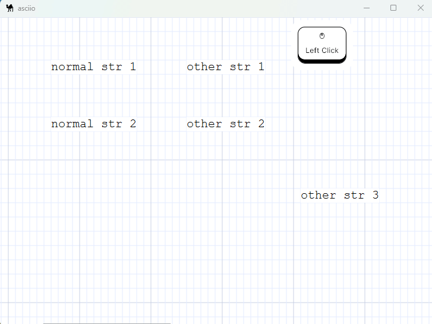
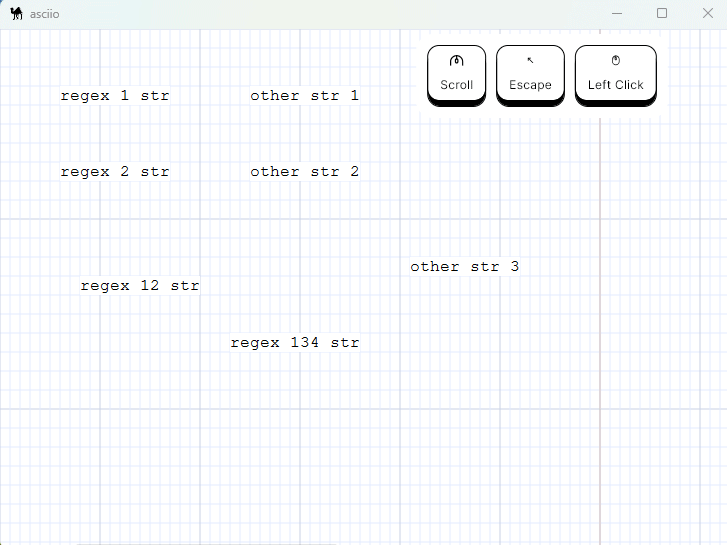

# find

## Introduction

The find mode is mainly used to find the location where our target text appears
in all asciio objects, and can quickly locate those matching positions and
highlight them. This is a special feature on the GUI port.

## Basic operations

### Entering and exiting find mode

| action         | binding       |
|----------------|---------------|
| Enter find mode | `<<f>>`      |
| Exit find mode  | `<<Escape>>` |

When you enter find mode, the mouse cursor will turn into a spider.After
exiting, the mouse pointer changes to the default shape.

### Operation after entering find mode

| action                 | binding                                           |
|------------------------|---------------------------------------------------|
| Perform new search     | `<<s>>`                                           |
| Jump to next match     | `<<n>>`                                           |
| Jump to previous match | `<<Shift+N>>`                                     |
| Zoom in                | `<<000-plus>>` `<<C0S-J>>` `<<C00-scroll-up>>`    |
| Zoom out               | `<<000-minus>>` `<<C0S-H>>` `<<C00-scroll-donw>>` |

After entering find mode, if we do not perform any search, no content will be
highlighted. At this time, press the `<<s>>` key to pop up a dialog box, enter
the characters to be found (regular expressions in Perl format are supported).

If a match is found, it will jump to the first matching character position,
and highlight the first match in blue, and other matches in purple. If you
press `<<n>>` or `<<N>>` to switch to the next or previous match, the current
match will be highlighted in blue and other matches will be highlighted in
purple.

If the position of the matching character is not in the current window,
it will automatically jump to the corresponding position. Canvas zoom can be
used during the search process to better locate character positions.

Example of finding a normal string:

Find examples of regular expressions:

Example of canvas zooming:

### Repeat find

If we exit the find mode and re-enter, the last keyword search will be performed
by default before pressing `<<s>>` to perform a new search. It just won't
automatically jump to the first match. If you need to jump, press `<<n>>` or
`<<N>>` again to perform the jump.

