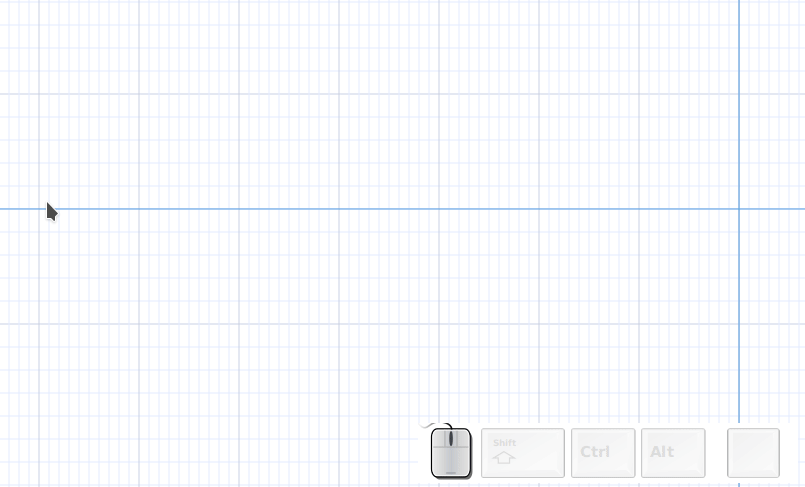
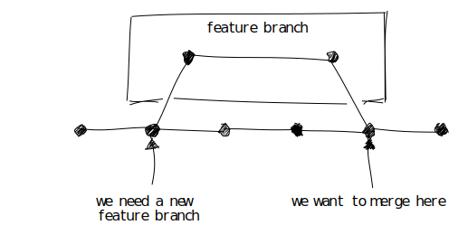
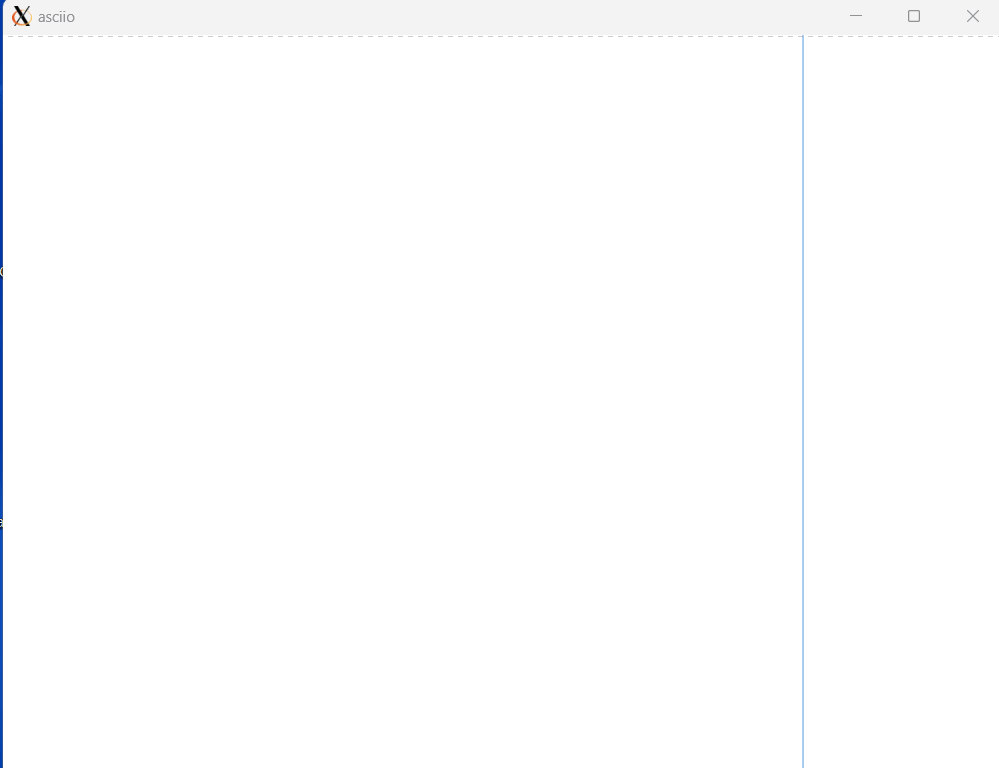

# git

```

                     .*-----*------------------------------*
                    /                                       \
                   /                                         \
           *------*---------*-----BETA---.                    \
                   \                      \                    \
                    \    .-----.           '                    \
 .-------------.     *---| fix |---*-----RELEASE 1.3------>*-----*---------*
 | Release 2.0 |         '-----'    \                     /               /
 |-------------|                     \                   /               /
 | changes     |------------------->  '---*-------*--------------*------*
 | tag: ...    |                           \           /
 | eta: ...    |                            \         /
 '-------------'                             *-------'

```

The git mode allows you to draw git graph quickly. It adds a binding 

```perl
'Mouse quick link git' => [['0A0-button-press-3', '00S-semicolon'],  \&App::Asciio::Actions::Git::quick_link]
```

when you press the semicolon:

- if nothing is under the pointer or selected, it will insert a commit node
- if a node is selected and nothing under the pointer, it will insert a new node and connect with the previously selected node
- if a node is selected and the pointer is over a node, it will link the nodes

Let's create a simple git graph




We can export the text and use it in our documentation

```
                 .----------------------------------.
                 |          feature branch          |
                 |                                  |
                 |       *-------------------*      |
                 |      /                     \     |
                 |     /                       \    |
                 '----/-------------------------\---'
                     /                           \
          *---------*---------*---------*---------*---------*
                    ^                             ^
                    |                             |
                    |                             |
                    |                             |
             we need a new              we want to merge here
             feature branch

```

or we can get some fancy SVGs





In the GUI of GTK3, the connector type and arrow type of git mode can be changed,
Here is an example in action:



The connector types supported by users can be configured in their own configuration:

```perl
GIT_MODE_CONNECTOR_CHAR_LIST => ['*', 'o', '+', 'x', 'X', '┼', '╋', '╬'],

DOUBLE_WIDTH_QR => qr/
			[\x{3400}-\x{4db5}] |
			[\x{4e00}-\x{9fa5}] |
			[\x{ac00}-\x{d7ff}] |
			[\x{3008}-\x{3011}] |
			[\x{2014}\x{2026}\x{3001}\x{3002}\x{3014}\x{3015}\x{FF01}\x{FF08}\x{FF09}\x{FF0C}\x{FF0E}\x{FF1A}\x{FF1B}\x{FF1F}\x{FF0F}\x{FF3C}]
			/x,
TAB_AS_SPACES => '    ',
```

The specific configuration is this line:
```
GIT_MODE_CONNECTOR_CHAR_LIST => ['*', 'o', '+', 'x', 'X', '┼', '╋', '╬'],
```

At the same time, the type of angled-arrow can also be modified:


> Note: To change the connector type, you must right-click on the connector element 
> to have the connector type menu in the menu that appears. Similarly, to change the 
> git mode angled-arrow type, you must right-click on the slanted arrow, and the menu 
> that appears will include the git mode arrow type change menu.

