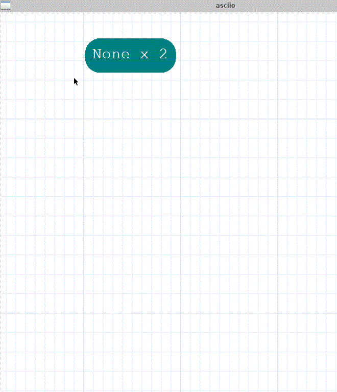
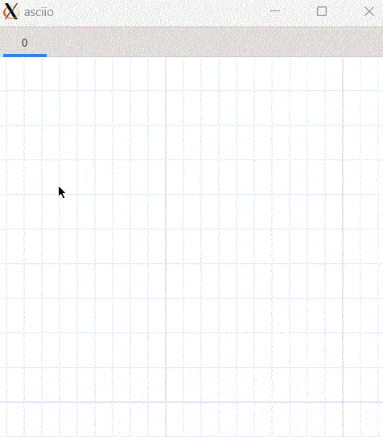

# Pen

The pen mode is used to draw one character (dot) at a time onto the canvas.

It can be used create ASCII art or stencils. 

## Operations

### Entering and exiting pen mode

| action           | binding         |
| ---------------- | --------------- |
| Enter pen mode   | `«00S-P»`       |
| Exit pen mode    | `«Escape»`      |

The mouse pointer changes to '?', the default character.

If elements are selected prior to entering pen mode, those characters will be used, in a loop, as default characters

### Drawing characters

- press the *left mouse button* or press the *Enter* key
- hold down the *left mouse button* and drag to continuously draw characters

### Changing the drawing character

- *press* a key on the keyboard
    - inserted the character
    - becomes the default character
- *right click* on a character

### Editing  

- **BackSpace** deletes characters
- **Shift + Enter** wraps lines.

### Efficient input using the keyboard

When drawing ASCII art with many small elements, using the keyboard is more efficient.

| action                       | binding                       |
| ---------------------------- | ----------------------------- |
| pen mouse move left          | `«C00-h»` `«000-Left»`        |
| pen mouse move right         | `«C00-l»` `«000-Right»`       |
| pen mouse move up            | `«C00-k»` `«000-up»`          |
| pen mouse move down          | `«C0S-j»` `«000-Down»`        |
| pen mouse move left quick    | `«0A0-h»`                     |
| pen mouse move right quick   | `«0A0-l»`                     |
| pen mouse move up quick      | `«0A0-k»`                     |
| pen mouse move down quick    | `«0A0-j»`                     |
| pen mouse move left tab      | `«00S-ISO_Left_Tab»`          |
| pen mouse move right tab     | `«000-Tab»`                   |

### Automatic cursor movement

When using the keyboard, the cursor can be moved automatically after you insert a character.

| action                         | binding         |
| ----------------------------   | --------------- |
| pen toggle insertion direction | `«C00-d»`       |

| shape                        | cursor movement    |
| ---------------------------- | ---------------    |
| square                       | none               |
| right triangle               | right one position |
| down triangle                | down one position  |

### Eraser

| action                           | binding         |
| ----------------------------     | --------------- |
| Enter eraser sub-operation group | `«C00-e»`       |
| Exit eraser sub-operation group  | `«Escape»`      |

Exiting the eraser sub-operation group will return to the pen operation group.

In the eraser sub-operation group, left-clicking the mouse deletes elements.

