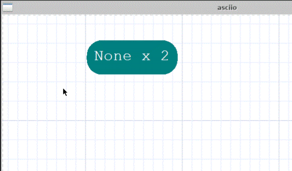
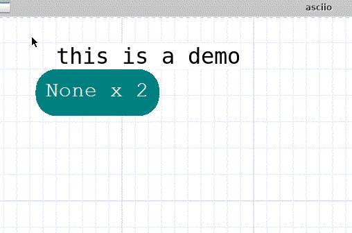

# pen

## Introduction

Pen mode is used to draw one character at a time into the canvas, often used
for small ascii art creations.

## Basic operations

### Entering and exiting pen mode

| action         | binding       |
|----------------|---------------|
| Enter pen mode | `<<b>>`       |
| Exit pen mode  | `<<Escape>>` |

After entering the **pen mode**, the mouse cursor will change into the shape of
a pen tip. Before any characters are changed, the question mark character is
currently inserted by default.

### Draw characters

1. Move the mouse to a certain position, then click the `left mouse button` or
the `Enter key` to insert a character at the current position.
2. Move the mouse to a certain position, then hold down the left mouse button,
drag the mouse, and continuously draw characters in each grid along the path
passed by the pen tip.

### Change the character drawn by the pen

* After entering pen mode, directly press the key corresponding to an ascii
character on the keyboard to switch to that character. Note: When pressed, one
is inserted at the current position.

* After entering pen mode, move the mouse to a non-empty character and
right-click. At this time, the character to be inserted becomes the character
at the current position, which is equivalent to character extraction. If the
characters in the current grid are stacked, take the top character.

* If the current mouse pointer is on a character before entering pen mode.
Then after entering pen mode, the inserted character becomes this character.

* If a part of the area is selected before entering pen mode, and the selected
elements contain characters, then these characters will be used as loop
insertion characters after entering pen mode. (This has the highest priority).

>In this case, the pen will loop through each non-blank character in the order 
in which it was extracted.

### Switch to pen mode’s built-in eraser mode

This is mainly used to delete a single element without exiting pen mode.

:TODO: The details will be added after the code is improved.

## Merge the completed ascii art into a text box

| action              | binding group                 | bingding  |
|---------------------|-------------------------------|-----------|
| convert to big text | `<<element leader>>`(`<<e>>`) | `<<S-T>>` |

The pen inserts a special type of elements called pixels, which have almost
no properties, no linker, and cannot be edited. After completing a small ASCII
art work, what needs to be done is to combine them into a text box for easy
management and subsequent reuse.

Although it can be done with a strip group, due to the special nature of pixel
elements, there is no point in saving copies of them, so we can make it simpler.

## Split any element into pixels

| action                  | binding group                 | bingding |
|-------------------------|-------------------------------|----------|
| convert to small pixels | `<<element leader>>`(`<<e>>`) | `<
>`  |

>Note: Do not perform this operation unless you know exactly what you are
doing, as it will delete the original element.

The main function of this function is to facilitate us to re-edit the saved
ascii art template text box

For example, in the picture below, we want to add a nose to the kitten:

