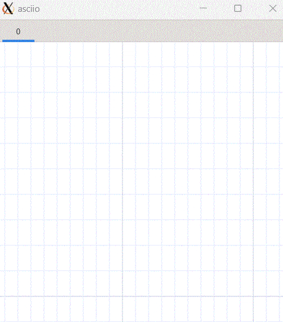

# pen

## Introduction

Pen mode is used to draw one character at a time into the canvas, often used
for small ascii art creations. It is also very convenient to use it for stencil
making .This is a special feature of the GUI port.

Here are a few examples of making ascii art.


Here are a few examples of making stencil.


## Basic operations

### Entering and exiting pen mode

| action         | binding       |
|----------------|---------------|
| Enter pen mode | `<<b>>`       |
| Exit pen mode  | `<<Escape>>` |


After entering the **pen mode**, The mouse pointer will change to a text pointer,
It means we can enter characters. Before any characters are changed, the question
mark character is currently inserted by default.

### Draw characters

1. Move the mouse to a certain position, then click the `left mouse button` or
the `Enter key` to insert a character at the current position.
2. Move the mouse to a certain position, then hold down the left mouse button,
drag the mouse, and continuously draw characters in each grid along the path
passed by the pen tip.


3. Press a key on the keyboard and the corresponding characters on the keyboard 
will be inserted immediately at the current position. And the character inserted
by the current mouse become the character you pressed. 


4. The overlay prompt has three shapes, which correspond to the position of the
cursor after different inputs.

| action                     | binding       |
|----------------------------|---------------|
| pen mouse toggle direction | `<<C00-Tab>>` |

(1). Square

After inserting a character, the cursor does not move automatically.

(2). Right triangle

After inserting a character, the cursor automatically moves to the right one
position, which can be used for automatic input in the horizontal direction.

(3). Downward triangle

After inserting a character, the cursor automatically moves down one position,
which can be used for automatic input in the vertical direction.


The **BackSpace** key can delete characters, In the latter two direction modes
the **Shift + Enter** key can wrap lines. You can imagine that you are free
input in a text editor.



### Fast keyboard-based movement

When we are drawing ascii art, we may have to draw many small elements, if we
click with the mouse every time we change the character,It may not be efficient,
but if you can operate it with a pure keyboard within a small range, it may be
much more efficient. Refer to vim editor, we also Customized a lot of Fast
keyboard-based movement.

| action                     | binding                     |
|----------------------------|-----------------------------|
| pen mouse move left        | `<<C00-h>>` `<<000-Left>>`  |
| pen mouse move right       | `<<C00-l>>` `<<000-Right>>` |
| pen mouse move up          | `<<C00-k>>` `<<000-up>>`    |
| pen mouse move down        | `<<C0S-j>>` `<<000-Down>>`  |
| pen mouse move left quick  | `<<0A0-h>>`                 |
| pen mouse move right quick | `<<0A0-l>>`                 |
| pen mouse move up quick    | `<<0A0-k>>`                 |
| pen mouse move down quick  | `<<0A0-j>>`                 |
| pen mouse move left tab    | `<<00S-ISO_Left_Tab>>`      |
| pen mouse move right tab   | `<<000-Tab>>`               |


### Types of characters that can be entered

By default, we type in ascii characters on the keyboard, including letters,
numbers and symbols. But if the user is Other character groups are customized in
`gui.pl`. So we just need to switch to that character group and press the
corresponding key on the keyboard.  The characters corresponding to the key in
the currently specified group will be entered instead of the default ascii
characters. 

| action                                    | binding         |
|-------------------------------------------|-----------------|
| Switch user-defined character set forward | `<<0A0-Enter>>` |
| Switch user-defined character set back    | `<<C00-Enter>>` |
| Toggle prompt keyboard position           | `<<C0S-Enter>>` |


```perl
PEN_CHARS_SETS => # For the mapping of keys to inserted characters in pen mode
					# Unlimited groups can be defined
					# Unmapped keys are inserted according to the keyboard value
	[
		{
		'~' => '─' , '!' => '▀' , '@' => '▁' , '#' => '▂'  , '$' => '▃' , '%' => '▄' ,
		'^' => '▅' , '&' => '▆' , '*' => '▇' , '(' => '█'  , ')' => '▉' , '_' => '▊' ,
		'+' => '▋' , '`' => '▋' , '1' => '▌' , '2' => '▍'  , '3' => '▎' , '4' => '▏' ,
		'5' => '▐' , '6' => '░' , '7' => '▒' , '8' => '▓'  , '9' => '▔' , '0' => 'À' ,
		'-' => '│' , '=' => '┌' , 'Q' => '┐' , 'W' => '└'  , 'E' => '┘' , 'R' => '├' ,
		'T' => '┤' , 'Y' => '┬' , 'U' => '┴' , 'I' => 'Ì'  , 'O' => 'Ð' , 'P' => '┼' ,
		'{' => 'Ã' , '}' => 'Ä' , '|' => 'Â' , 'q' => 'Á'  , 'w' => 'Å' , 'e' => 'Æ' ,
		'r' => 'Ç' , 't' => 'Ò' , 'y' => 'Ó' , 'u' => 'Ô'  , 'i' => 'Õ' , 'o' => 'à' ,
		'p' => 'á' , '[' => 'â' , ']' => 'ã' , '\\' => 'ì' , 'A' => 'ø' , 'S' => 'ù' ,
		'D' => 'ú' , 'F' => 'û' , 'G' => '¢' , 'H' => '£'  , 'J' => '¥' , 'K' => '€' ,
		'L' => '₩' , ':' => '±' , '"' => '×' , 'a' => '÷'  , 's' => 'Þ' , 'd' => '√' ,
		'f' => '§' , 'g' => '¶' , 'h' => '©' , 'j' => '®'  , 'k' => '™' , 'l' => '‡' ,
		';' => '†' , "'" => '‾' , 'Z' => '¯' , 'X' => '˚'  , 'C' => '˙' , 'V' => '˝' ,
		'B' => 'ˇ' , 'N' => 'µ' , 'M' => '∂' , '<' => '≈'  , '>' => '≠' , '?' => '≤' ,
		'z' => '≥' , 'x' => '≡' , 'c' => '─' , 'v' => '│'  , 'b' => '┌' , 'n' => '┐' ,
		'm' => '└' , ',' => '┘' , '.' => '├' , '/' => '┤' ,
		},
		{
		'1' => '┬', '2' => '┴', '3' => '┼',
		},
    ],
```

>The user-defined map content, there can be
>infinitely multiple groups(you can map a part of the keys for each group, and
>the unmaped part according to the default characters of the keyboard.).

By default, there is no overlay prompt because the keys on the keyboard
correspond to their characters. But if switch to the user-defined group, a
button prompt panel will appear for you. It is convenient for you to understand
the corresponding situation of the current key group. The position of the prompt
panel can be placed on the left or on the right, and the user switches according
to the current editing situation.


The layout of the prompt keyboard can also be customized. Currently, two
keyboard layouts are supported.

```perl
PEN_KEYBOARD_LAYOUT_NAME => 'US_QWERTY', # US_QWERTY or SWE_QWERTY
```

### Change the character drawn by the pen

* After entering pen mode, directly press the key corresponding to an ascii
character on the keyboard to switch to that character. Note: When pressed, one
is inserted at the current position.


* After entering pen mode, move the mouse to a non-empty character and
right-click. At this time, the character to be inserted becomes the character
at the current position, which is equivalent to character extraction. If the
characters in the current grid are stacked, take the top character.


* If the current mouse pointer is on a character before entering pen mode.
Then after entering pen mode, the inserted character becomes this character.


* If a part of the area is selected before entering pen mode, and the selected
elements contain characters, then these characters will be used as loop
insertion characters after entering pen mode. (This has the highest priority).


>In this case, the pen will loop through each non-blank character in the order 
in which it was extracted.

### Switch to pen mode’s built-in eraser mode

This is mainly to delete multiple or consecutive dot elements (pen elements)
without exiting pen mode. In pen mode, press the `<<Ctrl+Shift+Tab>>` key to
switch to the eraser.

Press the `<<Ctrl+Shift+Tab>>` key again to switch back to pen mode.


There are 3 ways to delete elements in pen mode:
1. In pen mode, place the cursor on the dot element (pen element), and then
    press the `<<Back Space>>` key.
2. In the eraser submode, Click the left mouse button directly on elements.
3. In the eraser submode，Click the left mouse button and then draging, then
    all elements encountered on the dragging path will be deleted.


## Merge the completed ascii art into a text box

| action                | binding group                 | bingding  |
|-----------------------|-------------------------------|-----------|
| convert to a big text | `<<element leader>>`(`<<e>>`) | `<<S-T>>` |

The pen inserts a special type of elements called dots, which have almost
no properties, no linker, and cannot be edited. After completing a small ASCII
art work, what needs to be done is to combine them into a stencil.

Although it can be done with a strip group, due to the special nature of dot
elements, there is no point in saving copies of them, so we can make it simpler.


## Split any elements into dots

| action                  | binding group                 | bingding  |
|-------------------------|-------------------------------|-----------|
| convert to dots         | `<<element leader>>`(`<<e>>`) | `<<S-D>>` |

>Note: Do not perform this operation unless you know exactly what you are
doing, as it will delete the original elements.

The main function of this function is to facilitate us to re-edit the saved
ascii art template text box

For example, in the picture below, we want to add a nose to the kitten:


