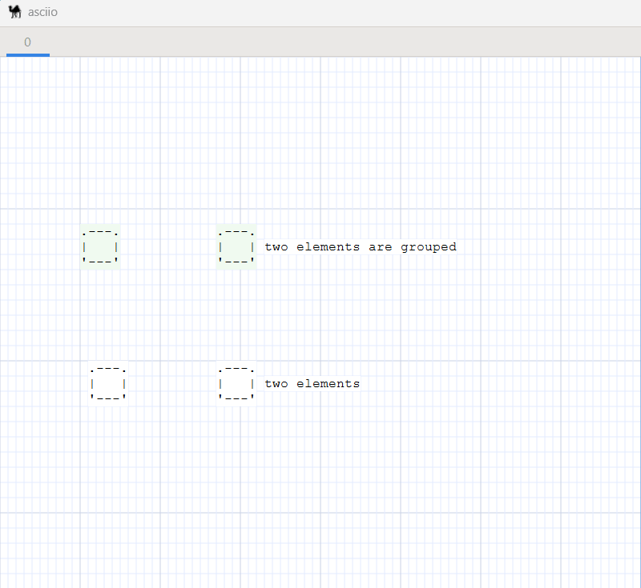
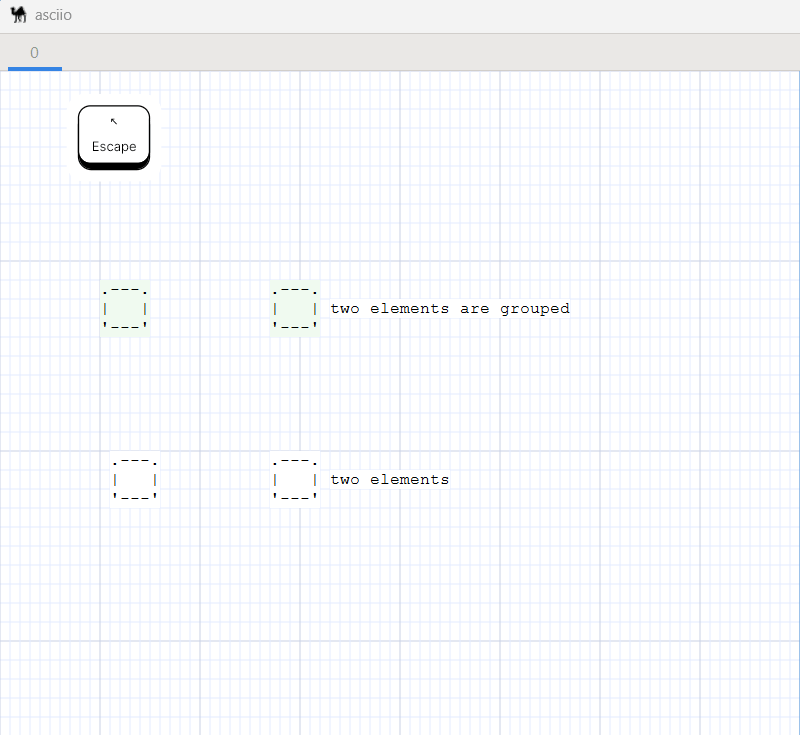

# selection

## Introduction

In addition to using rectangular selection boxes or directly clicking on them,
there are other options for selecting elements, which is to use the selection
operation group, which allows us to conveniently select elements in irregular
areas. There are two main forms, mouse drawing polygon selection or mouse click
and drag selection.

## Basic operations

### Entering and exiting selection mode

| action                                      | binding                        |
|---------------------------------------------|--------------------------------|
| Enter selection mode                        | `<<s>>`                        |
| Exit selection mode                         | `<<Escape>>` and `<<<s>>>`     |
| Toggle selection and deselection            | `<<<e>>>`                      |
| Select motion                               | `<<<mouse_motion>>>`           |
| Select mouse click                          | `<<<left_mouse_button>>>`      |
| Select motion ignore group                  | `<<<Ctrl-mouse_motion>>>`      |
| Select mouse click ignore group             | `<<<Ctrl-left_mouse_button>>>` |
| Enter the polygon selection operation group | `<<<x>>>`                      |

**Polygon selection operation group operation collection**: 

| action                      | binding                      |
|-----------------------------|------------------------------|
| Exit polygon selection mode | `<<<Escape>>>` and `<<<x>>>` |
| Polygon select motion       | `<<<mouse_motion>>>`         |
| Polygon deselect motion     | `<<<Ctrl-mouse_motion>>>`    |
| Select mouse click          | `<<<left_mouse_button>>>`    |

### Operation after entering selection mode

Common selection operation example:

Example if you want to ignore the group and select only the elements in the group:

### Operation after entering polygon selection mode

1. selection situation.
2. deselection situation.

