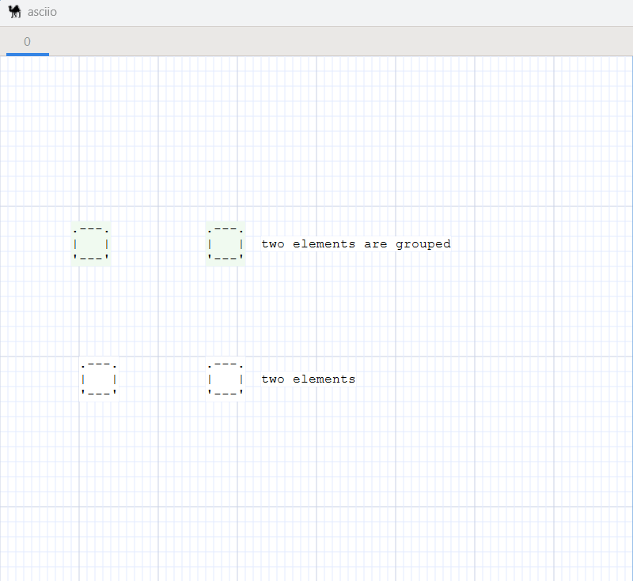

# Selection

Select elements by:

- clicking on them
    - «left-click» - select the element
    - «Shift» + «left-click» - add the element to the current selection
- using the rectangular selection boxes - «left-click» + «drag»

There are more options for selecting elements:

- graph selection group
- mouse-drawn polygon selection
- mouse-move selection (with the left mouse button held down)

## Graph selection group

**Prefix:** All operations require pressing `«S»` to enter the graph selection mode

| action               | binding |
| -------              | ------- |
| Select neighbors     | «n»     |
| Select predecessors  | «p»     |
| Select ancestors     | «a»     |
| Select successors    | «s»     |
| Select descendants   | «d»     |
| select reachable     | «r»     |
| Select all connected | «c»     |


```text
.---------------------------------------------------------.
|                   all connected nodes                   |
|---------------------------------------------------------|
|             .----------.       .-----------.            |
|             | ancestor |---.---| reachable |            |
|             '----------'   |   '-----------'            |
|                            |                            |
|                            |                            |
|                            v                            |
|                .----------------------.                 |
|        .-------| predecessor-neighbor |                 |
|        |       '----------------------'                 |
|        |                  |                             |
|        v                  v                             |
| .-----------.          .------.                         |
| |    not    |  .-------| node |--------.                |
| | reachable |  |       '------'        |                |
| '-----------'  |                       |                |
|                v                       v                |
|     .--------------------.  .--------------------.      |
|     | successor-neighbor |  | successor-neighbor |      |
|     '--------------------'  '--------------------'      |
|                |                       |                |
|                v                       v                |
|         .------------.          .-----------.           |
|         | descendant |          | reachable |           |
|         '------------'          '-----------'           |
'---------------------------------------------------------'
```

## Polygon and Mouse-move selection mode

### Entering and exiting selection mode

**Prefix:** All operations require pressing `«s»` to enter the selection mode

| action                                      | binding                        |
|---------------------------------------------|--------------------------------|
| Enter selection mode                        | `<<s>>`                        |
| Exit selection mode                         | `<<Escape>>` and `<<<s>>>`     |
| Toggle selection and deselection            | `<<<e>>>`                      |
| Select motion                               | `<<<mouse_motion>>>`           |
| Select mouse click                          | `<<<mouse_left_button>>>`      |
| Enter the polygon selection operation group | `<<<x>>>`                      |

**Polygon selection operation group operation collection**: 

| action                      | binding                      |
|-----------------------------|------------------------------|
| Exit polygon selection mode | `<<<Escape>>>` and `<<<x>>>` |
| Polygon select motion       | `<<<mouse_motion>>>`         |
| Polygon deselect motion     | `<<<Ctrl-mouse_motion>>>`    |


### Operation after entering selection mode

Common selection operation example:



### Operation after entering polygon selection mode

1. selection situation.
2. deselection situation.


