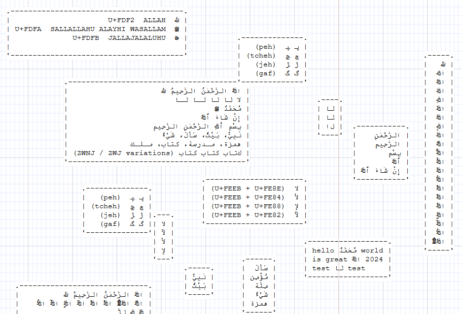
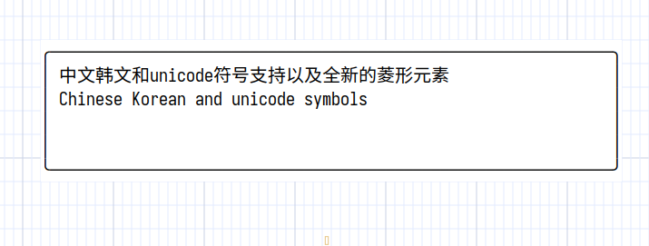
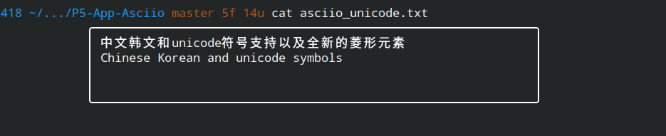
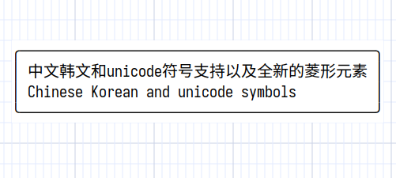

# Multi-language support

## Support status

Asciio supports Unicode and supports some specific languages. But if you need to
align them, you need to install specific fonts first.

Supported language families and fonts that need to be installed:

| Language combination types   | Fonts that need to be installed                                                        |
|------------------------------|----------------------------------------------------------------------------------------|
| CJK(Chinese/Japanese/Korean) | [unifont](https://github.com/multitheftauto/unifont/releases/) Download: unifont-*.ttf |
| Arabic and Hebrew            | Courier New(This font most systems built in)                                           |

After installing a specific font, just press `«z-f»` to switch to the specific font alignment in the chart.







In the examples above the box is drawn with unicode characters, the box is oversized by design, it shrinks and expands properly.



When displayed in exported software, you also need a font that aligns them.

```txt
.----------------------------------.
| שָׁלוֹם שָׁלוֹם שָׂרָה                    |
| בְּרֵאשִׁית בָּרָא אֱלֹהִים                 |
| יִשְׂרָאֵל יְרוּשָׁלַיִם                    |
| אב אב אב (ZWJ / ZWNJ variations) |
| מַה־שְּׁלוֹמְךָ                         |
| לְשׁוֹן־הַקֹּדֶשׁ                        |
'----------------------------------'
```

The following example files in the `examples` directory are about multi-language support.

- examples/chinese_test.asciio
- examples/arabic_test.asciio

## Limitation

Currently, mixing CJK with Arabic or Hebrew is not supported.

No existing monospace font provides correct alignment for both CJK full-width
characters and Arabic/Hebrew shaping at the same time.

