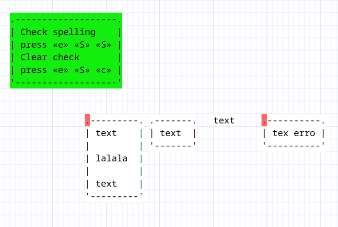
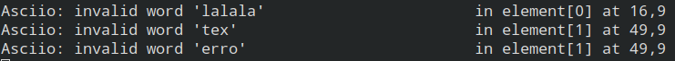

# Spellchecking Elements

[**Bindings**](spellchecking_operation.md)

Asciio can optionally spellcheck for erroneous words in your elements and mark them.

Asciio will display the errors in the terminal.

You need to have module ***Text::SpellChecker*** installed, that module requires that you have Aspell dev installed as well as a compiler, making spellchecking an option.  
