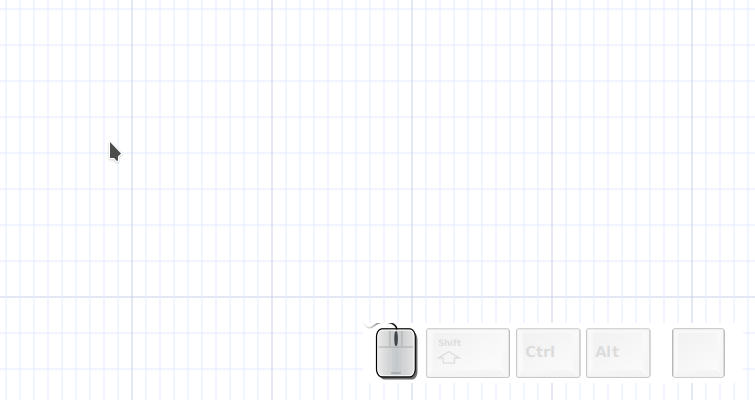
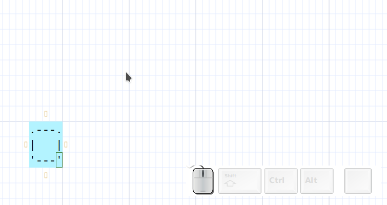
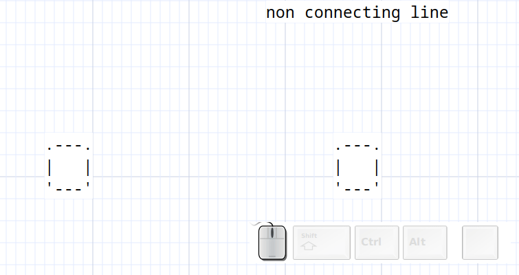

# Asciio arrows

| element           | binding   |
| ---------------   | --------- |
| Add arrow         | «ia»      |
| Add Unicode arrow | «i+Alt-a» |
| Add angled arrow  | «iA»      |



## wirl-arrow

Rotating the end clockwise or counter-clockwise changes its direction.


## multi section wirl-arrow

A set of whirl arrows connected to each other.



## angled-arrow and axis


Note that an axis doesn't connect.

### Connecting lines

A specialized **wirl-arrow** with no head nor tail.

| element                 | binding         |
| ---------------         | ---------       |
| Add ASCII line          | «il»            |
| Add Unicode line        | «iL»            |
| Add Unicode bold line   | «i+Alt-l»       |
| Add Unicode double line | «i+Shift+Alt-l» |



### Non connecting lines

A specialized **wirl-arrow** with no head nor tail and auto-connection turned off, it's often used to draw the table in the crossing mode.

| element                                | binding         |
| ---------------                        | ---------       |
| Add ASCII non-connecting line          | «ik»            |
| Add Unicode non-connecting line        | «iK»            |
| Add Unicode non-connecting bold line   | «i+Alt-k»       |
| Add Unicode non-connecting double line | «i+Shift+Alt-K» |


## ascii line

```
                    ----------------------.
                                          |
                                          |
                                          |
                                          |
                                          |
```

## unicode line

```
                      ─────────────────────────╮
                                               │
                                               │
                                               │
                                               │
                                               │

```

## unicode bold line

```
                        ━━━━━━━━━━━━━━━━━━━━━━━┓
                                               ┃
                                               ┃
                                               ┃
                                               ┃

```

## unicode double line

```
                  ═══════════════════════════╗
                                             ║
                                             ║
                                             ║
                                             ║
                                             ║

```

## Example of non-connecting lines in crossing mode

```
                     ╔═════╦═════╦══════╦═════╦════╦═════╗
                     ║     ║     ║      ║     ║    ║     ║
                     ╠═════╬═════╬══════╬═════╬════╬═════╣
                     ║     ║  A  ║      ║  B  ║    ║     ║
                     ╠═════╬═════╬══════╬═════╬════╬═════╣
                     ║     ║  C  ║      ║     ║    ║     ║
                     ╠═════╬═════╬══════╬═════╬════╬═════╣
                     ║     ║     ║      ║     ║  D ║     ║
                     ╠═════╬═════╬══════╬═════╬════╬═════╣
                     ╚═════╩═════╩══════╩═════╩════╩═════╝

```

