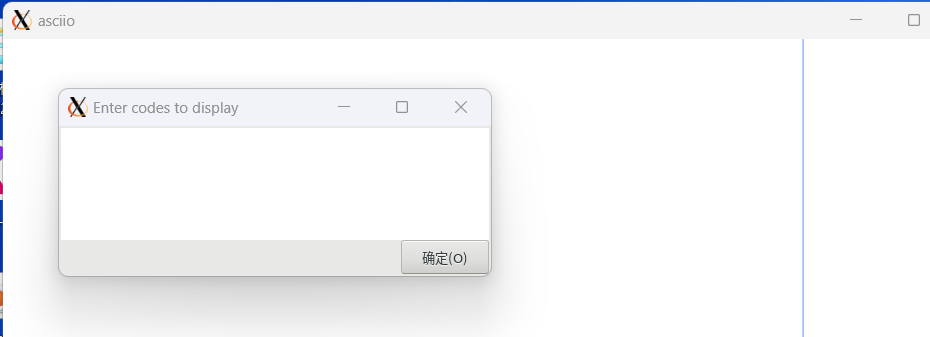

# Asciio boxes
         «B»                Add shrink box

         «b»                Add box

         «A-b»              Add unicode box

         «E»                Add exec-box no border

         «e»                Add exec-box

         «f»                Insert from file

         «g»                Add group object type 1

         «h»                Add help box

         «i»                Add if-box

         «x»                External command output in a box

         «X»                External command output in a box no frame

         «p»                Add process

         «t»                Add text

   
## boxes and text
                    .----------.
                    |  title   |
     .----------.   |----------|   ************
     |          |   | body 1   |   *          *
     '----------'   | body 2   |   ************
                    '----------'
                                          any text
                                (\_/)         |
            text                (O.o)  <------'
                                (> <)

## if-box and process-box

       .--------------.    
      / a == b         \     __________
     (    &&            )    \         \
      \ 'string' ne '' /      ) process )
       '--------------'      /_________/

### user boxes and exec-boxes

For simple elements, put your design in a box, with or without a frame.

The an "exec-box" object that lets you put the output of an external
application in a box, in the example below the table is generated, if
you already have text in a file you can use 'cat your_file' as the
command.

      +------------+------------+------------+------------+
      | input_size ‖ algorithmA | algorithmB | algorithmC |
      +============+============+============+============+
      |     1      ‖ 206.4 sec. | 206.4 sec. | 0.02 sec.  |
      +------------+------------+------------+------------+
      |    250     ‖     -      |  80 min.   | 2.27 sec.  |
      +------------+------------+------------+------------+

### code box

This is a special box that will automatically display the line number 
after inputting the content. It is mainly used to place code and other 
content that requires line numbers for display.

In the GUI interface

Bindings:

«i» Insert group:


       «C-c»              'create code box' 
       «A-c»              'create code box no frame'




When the above screen appears, enter the text content into the input box,
Then you will get the following box

```
       .----------------------------------------------------.
       |  0|trim_s ()                                       |
       |  1|{                                               |
       |  2|    # Usage: trim_s "   example   string    "   |
       |  3|    : "${1#"${1%%[![:space:]]*}"}"              |
       |  4|    : "${_%"${_##*[![:space:]]}"}"              |
       |  5|    printf '%s\n' "$_"                          |
       |  6|}                                               |
       |  7|                                                |
       |  8|trim_all () {                                   |
       |  9|    # Usage: trim_all "   example   string    " |
       | 10|    local deal_str="$1"                         |
       | 11|    declare -a str_arr                          |
       | 12|    read -d "" -ra str_arr <<<"$deal_str"       |
       | 13|    deal_str="${str_arr[*]}"                    |
       | 14|    printf "%s\n" "$deal_str"                   |
       | 15|                                                |
       | 16|}                                               |
       '----------------------------------------------------'

```
Below is the borderless mode

```
         0|trim_s ()                                      
         1|{                                              
         2|    # Usage: trim_s "   example   string    "  
         3|    : "${1#"${1%%[![:space:]]*}"}"             
         4|    : "${_%"${_##*[![:space:]]}"}"             
         5|    printf '%s\n' "$_"                         
         6|}                                              
         7|                                               
         8|trim_all () {                                  
         9|    # Usage: trim_all "   example   string    "
        10|    local deal_str="$1"                        
        11|    declare -a str_arr                         
        12|    read -d "" -ra str_arr <<<"$deal_str"      
        13|    deal_str="${str_arr[*]}"                   
        14|    printf "%s\n" "$deal_str"                  
        15|                                               
        16|}                                              

```


But note that when the box is edited again, the line number content has 
become part of the box text, so editing again will not update the line number. 
A codebox needs to be regenerated.That is to say, only when the code box is 
initialized, the line number will be automatically generated.


