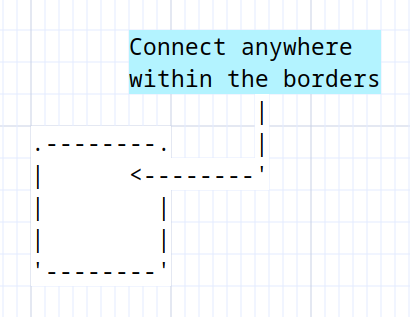

# Asciio boxes

## Elements

## popup menu

You can access some functionality via the popup menu.

### auto-shrink

If the text is changed, the size of the box will change to fit.

### disable connectors

Enable or disable the possibility to connect to the box.

### disable optimize

A standard box had four connectors, Asciio optimizes the arrow routes so they don't cross the box. You can disable that optimization.

### connect inside element borders

Allow connection to be made anywhere inside the element borders , not just the connectors.

### rotate box/text

## Types

### A box

***Binding:*** «ibb»              Add box

### A box with the frame drawn with Unicode characters

***Binding:*** «iub»              Add unicode box

### A text

Texts are just boxes without frames.

***Binding:*** «it»               Add text

### A shrink-box 

A box which is already has auto-shrink set

***Binding:*** «ibs»              Add shrink box

