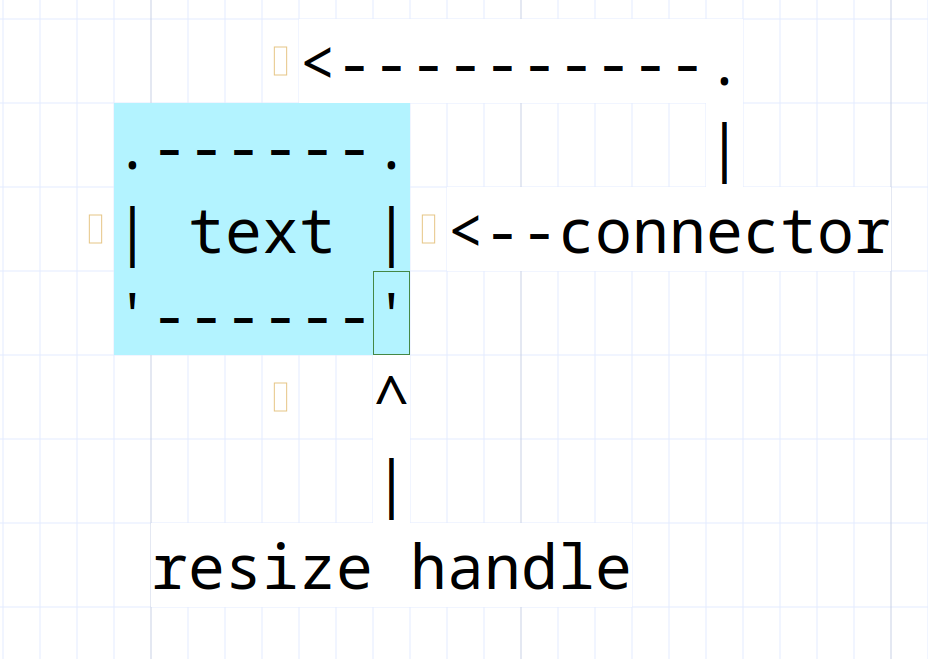

# Asciio boxes

## Elements

### popup menu

You can access some functionality via the popup menu.

### auto-shrink

If the text is changed, the size of the box will change to fit.

### auto-connection

Enable or disable the possibility to connect to the box.

### border-connection

allow connection to be made anywhere on the box , not just the connectors,

### rotate box/text

## Types

### A box

Binding: «b»                Add box

### A box with the frame drawn with Unicode characters

Binding: «A-b»              Add unicode box

### A text

Texts are just boxes without frames.

Binding: «t»                Add text

### A shrink-box 

A box which is already has auto-shrink set

Binding: «B»                Add shrink box

