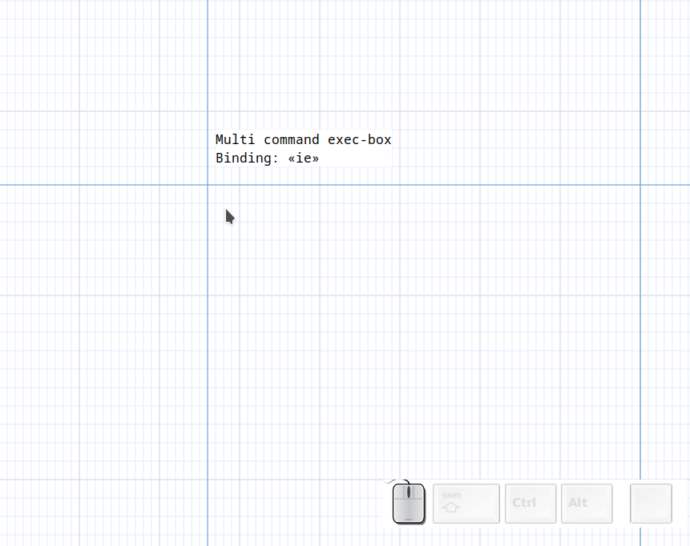
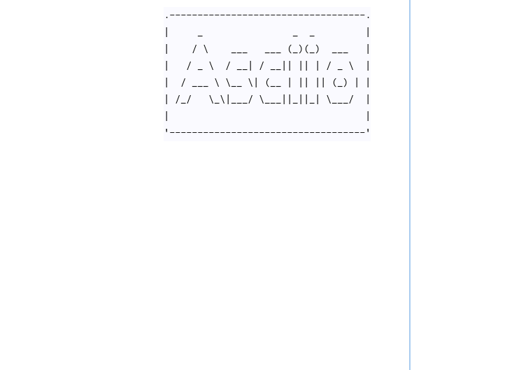

# Asciio exec-boxes

An "exec-box" is and object that lets you run an external command and put its output in a box. There are different types of exec-boxes explained below.

## Multi command

Binding: «ie» Add exec box              

The simplest exec-box accepts multiple commands, one per line. It will redirect stderr for each command.

Editing the box will let you edit the command.



## Verbatim 

Binding: «iv» Add exec box verbatim     

This exec-box doesn't redirect stderr, you can use it for commands that span multiple line or commands that take a multi line input

Editing the box will let you edit the command.


## Once

Binding: «io» Add exec box verbatim once

This exec-box will run your commands once, editing the box will let you edit the command's output.


## Add line numbers

Binding: «i + c-l» Add line numbered box     

This is an example of a custom stencil which will add line numbers to your input.


## Examples

### Using previously generated output

If you already have text in a file you can use 'cat your_file' as the command.

### Tables

tbd: Command: ...

      +------------+------------+------------+------------+
      | input_size ‖ algorithmA | algorithmB | algorithmC |
      +============+============+============+============+
      |     1      ‖ 206.4 sec. | 206.4 sec. | 0.02 sec.  |
      +------------+------------+------------+------------+
      |    250     ‖     -      |  80 min.   | 2.27 sec.  |
      +------------+------------+------------+------------+

### FIGlet


[Figlet](http://www.figlet.org/)  generates large letters out of ordinary text.


You can specify a font with the *-f* option. 

```bash

$ ls /usr/share/figlet/
646-ca.flc   646-hu.flc   646-se2.flc  big.flf       lean.flf      smslant.flf
646-ca2.flc  646-irv.flc  646-yu.flc   block.flf     mini.flf      standard.flf
646-cn.flc   646-it.flc   8859-2.flc   bubble.flf    mnemonic.flf  term.flf
646-cu.flc   646-jp.flc   8859-3.flc   digital.flf   moscow.flc    upper.flc
646-de.flc   646-kr.flc   8859-4.flc   frango.flc    script.flf    ushebrew.flc
646-dk.flc   646-no.flc   8859-5.flc   hz.flc        shadow.flf    uskata.flc
646-es.flc   646-no2.flc  8859-7.flc   ilhebrew.flc  slant.flf     utf8.flc
646-es2.flc  646-pt.flc   8859-8.flc   ivrit.flf     small.flf
646-fr.flc   646-pt2.flc  8859-9.flc   jis0201.flc   smscript.flf
646-gb.flc   646-se.flc   banner.flf   koi8r.flc     smshadow.flf

```

For example, we want to specify this font: `slant`



This is the exported effect:

```
            .-----------------------------------.
            |     _                _  _         |
            |    / \    ___   ___ (_)(_)  ___   |
            |   / _ \  / __| / __|| || | / _ \  |
            |  / ___ \ \__ \| (__ | || || (_) | |
            | /_/   \_\|___/ \___||_||_| \___/  |
            |                                   |
            '-----------------------------------'

            .------------------------------------.
            |     ___                 _  _       |
            |    /   |   _____ _____ (_)(_)____  |
            |   / /| |  / ___// ___// // // __ \ |
            |  / ___ | (__  )/ /__ / // // /_/ / |
            | /_/  |_|/____/ \___//_//_/ \____/  |
            |                                    |
            '------------------------------------'

```

### Diagon

[Diagon](https://github.com/ArthurSonzogni/Diagon) transforms markdown expressions into an ascii-art representation.


#### Mathematical Expressions


#### File Tree

Use ***exec verbatim box*** to input multiple lines.


### plantuml

[PlantUML](https://plantuml.com/zh/ascii-art)


