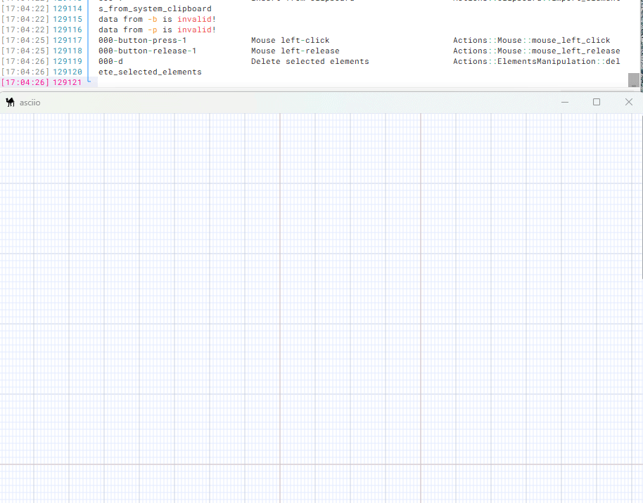
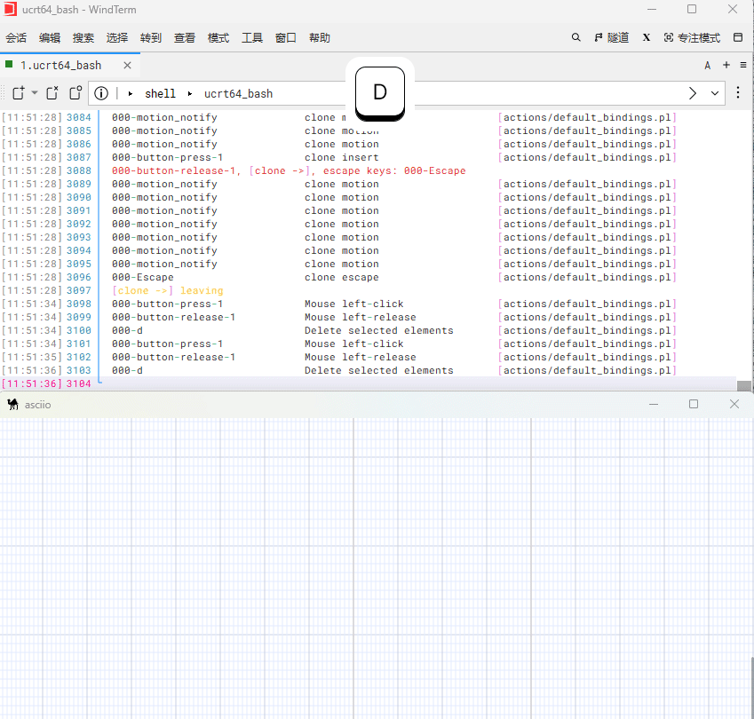
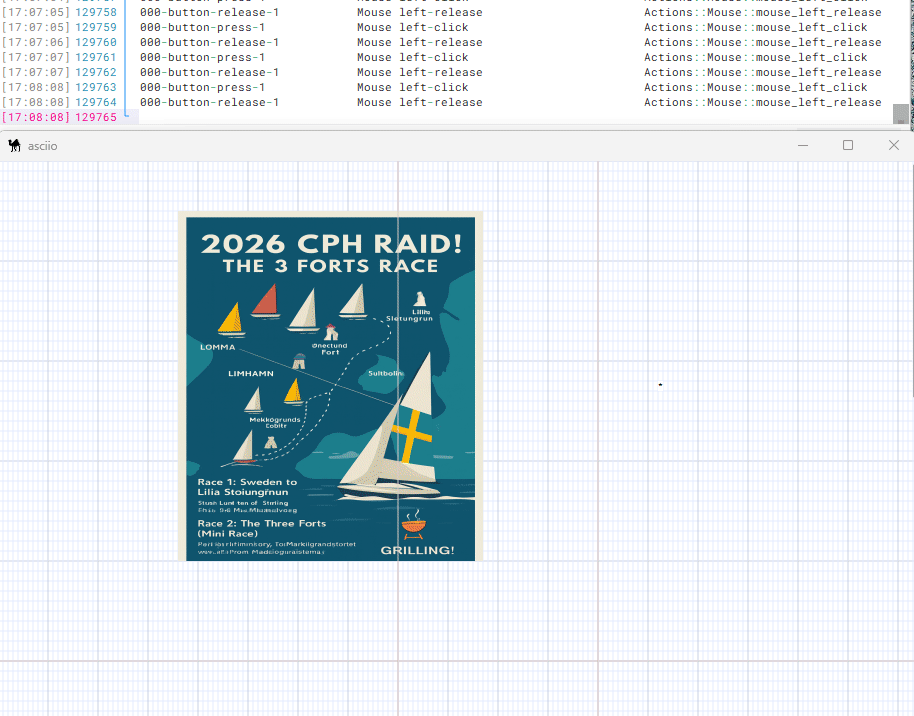
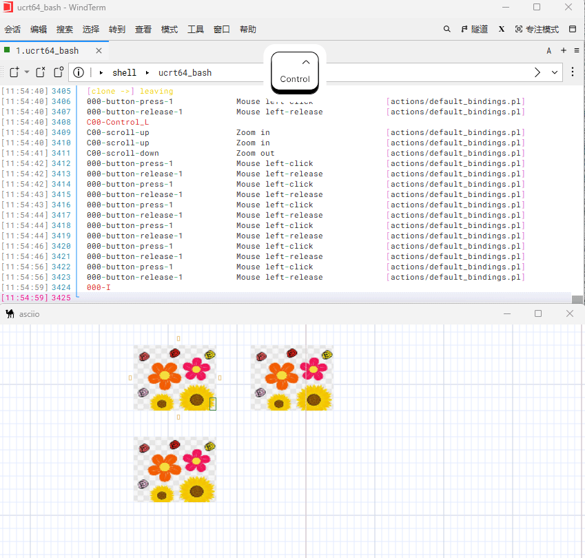
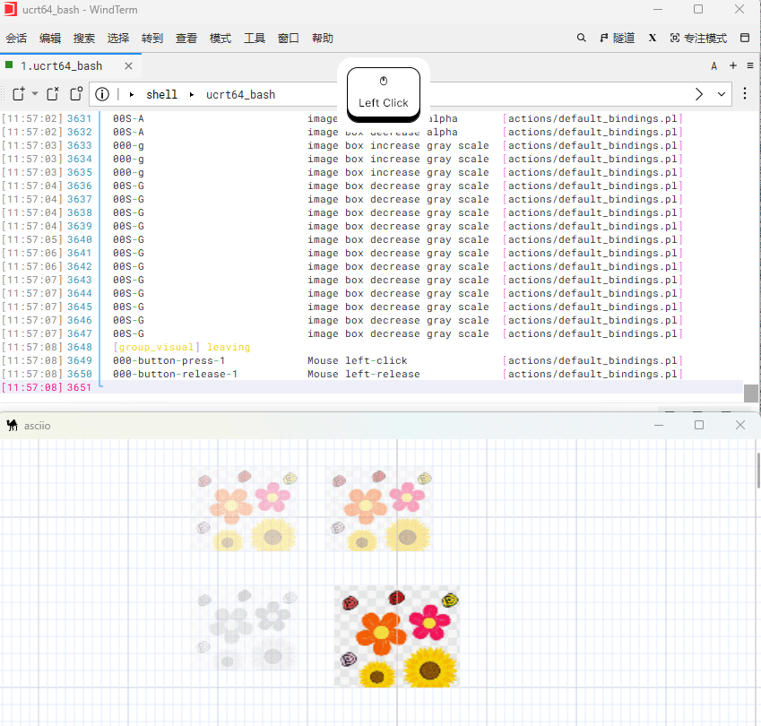

# Asciio image box

The purpose of an image box is to have a background image; it's ideal as a background when creating ASCII Art in **Pen Mode**.

- Image boxes have grayscale and transparency settings
- Images aren't exported instead a text placeholders will be exported




## Bindings

**Prefix:** All operations require pressing `«I»` to enter the **image Box** group.

| action                             | binding |
| ---------------------------------- | ------- |
| Enter image box group              | `«I»`   |
| [All bindings](../image_box_operations.md) ||


## Create an image box from a file

| action                   | biding |
| -------                  | ------ |
| inserted from file | `«i»`  |




## Image box operations

Image boxes, like ordinary boxes, support resizing and moving.



### image box visual controls sub group

| action            | binding |
|------------------ | ------- |
| rendering control | `«<c»`  |
---

| action                | bingding |
| --------------------- | -------- |
| increase gray scale   | `«g»`    |
| decrease gray scale   | `«G»`    |
| increase alpha        | `«a»`    |
| decrease alpha        | `«A»`    |
| revert to default     | `«o»`    |



## Freezing image boxes

Bindings:

| action                         | binding |
| ------------------------------ | ------- |
| freeze               | '«f»`   |
| thaw                 | '«t»`   |

Frozen image boxes

- Can't be resized.
- Can't be moved.
- Can't be deleted.

Only image boxes can be frozen.



## Copy and paste the image from the clipboard

Under `Linux` system, we need to install the `xclip` tool.

Copy an image to the clipboard through one of the following commands:

-  If the image is in `PNG` format then use the following command

```bash
xclip -selection clipboard -t image/png -i image.png
```

-  If the image is in `JGEG/JPG` format, then use the following command

```bash
xclip -selection clipboard -t image/jpeg -i image.jpg
```

Under the `Windows` system, we can directly use the system function to copy a
picture.

Use `Ctrl+v` directly in the canvas to paste the image into the canvas,
and it will automatically create an image box.


