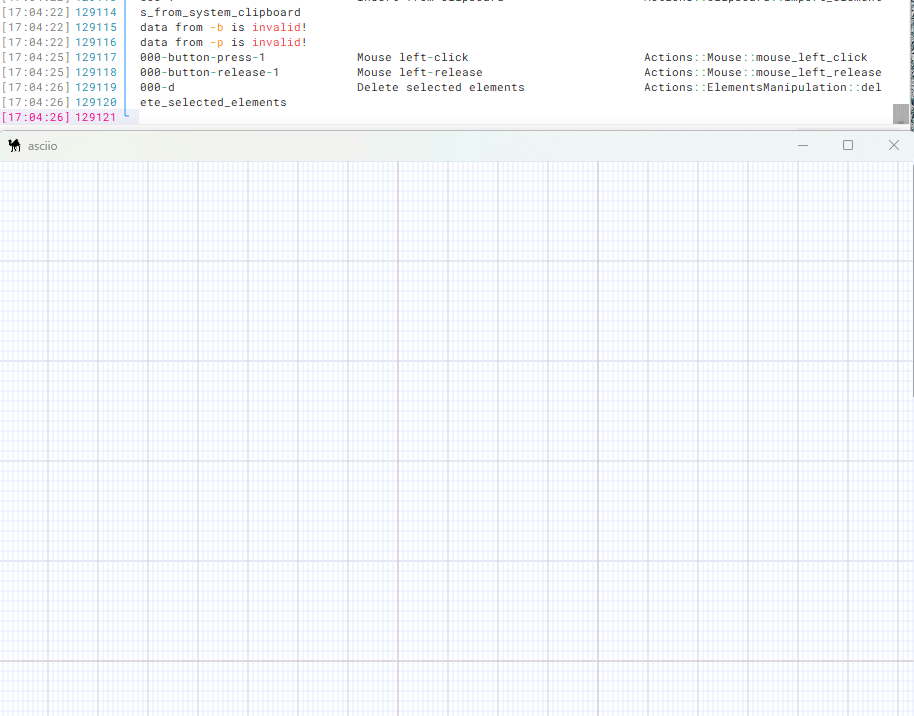
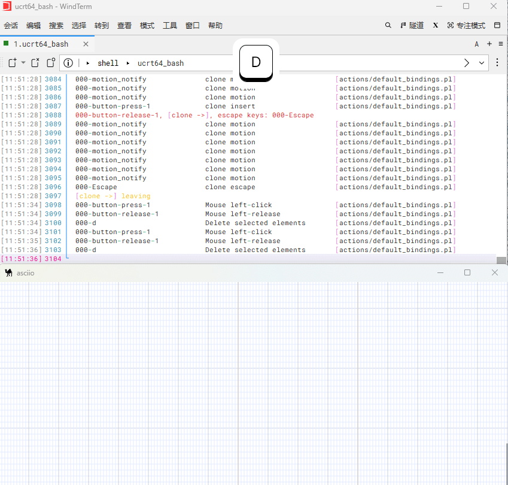
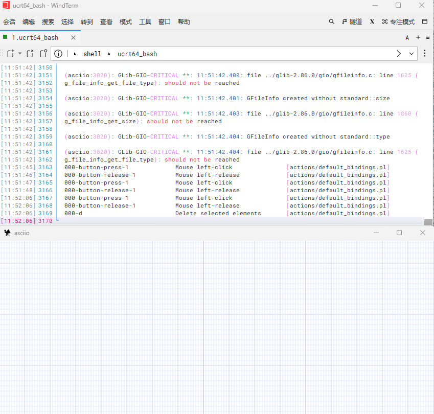
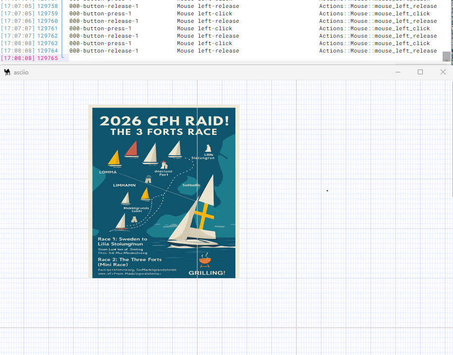
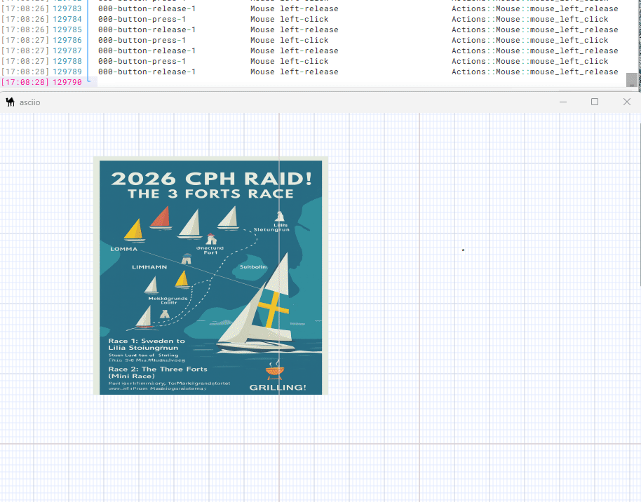
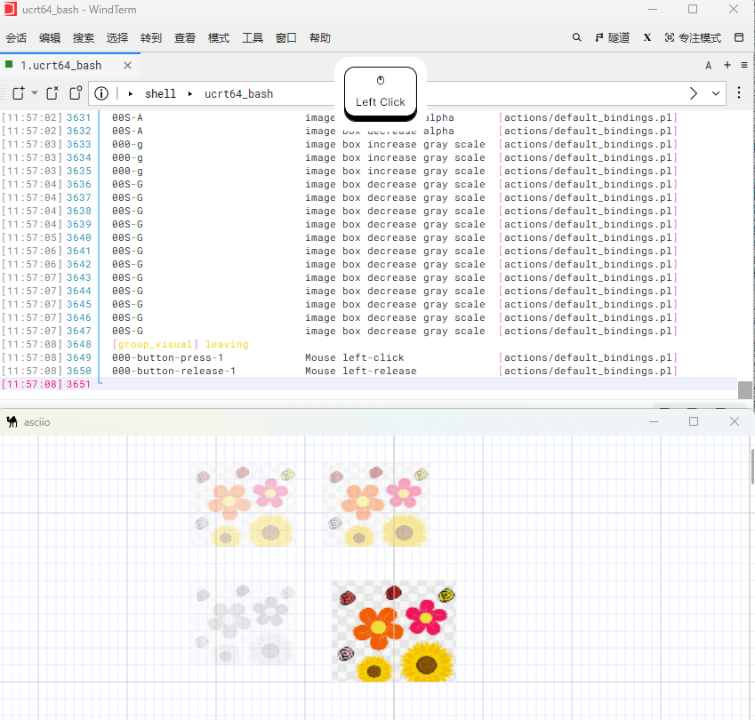

# Asciio image box

***Binding:*** «I»

The only purpose of an image box is to have a background image.

Images aren't exported as ASCII, instead a placeholders will be exported.

Image boxes have grayscale and transparency settings, it's ideal for use as a
background when we create ASCII Art in `pen mode`.



## Create an image box

### From an image file

***Binding:*** «I» + «i»



### Copy and paste the image from the clipboard

Under `Linux` system, we need to install the `xclip` tool.

Copy an image to the clipboard through one of the following commands:

-  If the image is in `PNG` format then use the following command

```bash
xclip -selection clipboard -t image/png -i image.png
```

-  If the image is in `JGEG/JPG` format, then use the following command

```bash
xclip -selection clipboard -t image/jpeg -i image.jpg
```

Under the `Windows` system, we can directly use the system function to copy a
picture.

Use `Ctrl+v` directly in the canvas to paste the image into the canvas,
and it will automatically create an image box.



## Image box operations

Image boxes, like ordinary boxes, support resizing and moving.



Color and alpha operations:

***Binding:*** «I» + «v»

| action                        | binding |
|------------------------------ |-------- |
| image box increase gray scale |  'g'    |
| image box decrease gray scale |  'G'    |
| image box increase alpha      |  'a'    |
| image box decrease alpha      |  'A'    |
| image box revert to default   |  'o'    |



## Freezing image boxes

**Frozen image boxes:**

- Can't be resized.
- Can't be moved.
- Can't be deleted.

Only image boxes can be frozen.

**Freezing operations:**

| action                         | binding   |
|--------------------------------|-----------|
| image box freeze               | 'I' + `f` |
| image box thaw                 | 'I' + `t` |

Once frozen, image boxes act as if they are a part of the canvas.



