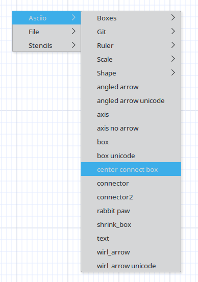
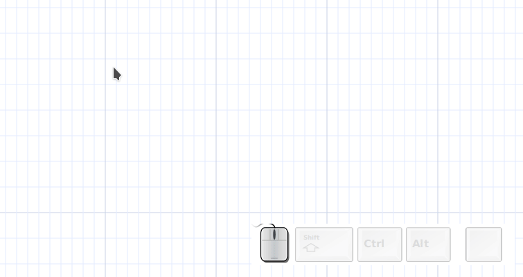

# Pseudo-connectors

Pseudo-connectors are a one-glyph-text boxes, used by *git mode* for example, which can also be used to add connectors to user-created groups.

- create a pseudo-connector
- change its glyph if necessary
- place it
- group all your elements

## pseudo-connector with 4 "optimized" connectors

| Binding | Connector |
| ------- | --------- |
| o       | «ic»      |
| *       | «iC»      |

## pseudo-connector with one connector

Use a "center connect box"

Using the character under the current cursor to Create a "center connect box". 
Visually, this connector looks like it is one piece with the underlying element.

# Example

