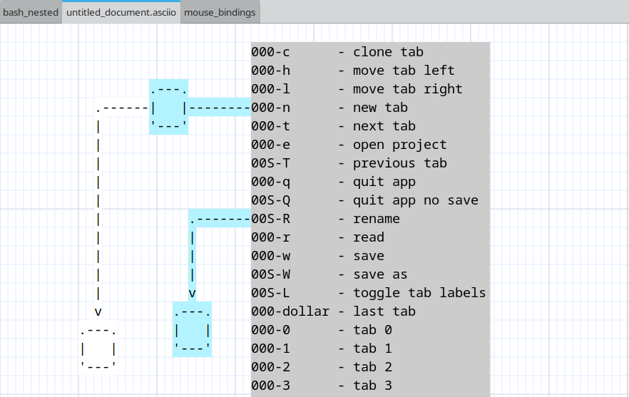

# Asciio Tab Management

## Overview

Asciio provides a comprehensive tab-based workflow system that allows you to work with multiple documents simultaneously within a single application window. Each tab represents an independent drawing canvas, and you can organize, navigate, and manage these tabs efficiently through a variety of operations.

***Bindings:*** [Tab Management](bindings_group_tabs.md)

---

## Index

### Creating New Tabs

[Creating new tabs](#creating-new-tabs) | [Duplicating tabs](#duplicating-tabs) | [Closing tabs](#closing-tabs)

### Tab Navigation

[Sequential navigation](#sequential-navigation) | [Direct tab access](#direct-tab-access) | [Jump to last tab](#jump-to-last-tab)

### Tab Organization

[Moving tabs](#moving-tabs) | [Renaming tabs](#renaming-tabs) | [Tab label visibility](#tab-label-visibility)

### Project Operations

[Opening projects](#opening-projects) | [Saving projects](#saving-projects) | [Reading files into tabs](#reading-files-into-tabs)

### Application Control

[Exiting the application](#exiting-the-application)

### Workflow Tips

[Organizing multiple documents](#organizing-multiple-documents) |
[Project management strategy](#project-management-strategy)

[Handling name conflicts](#handling-name-conflicts) |
[Maximizing canvas space](#maximizing-canvas-space)

---

## Tab Creation and Removal

### Creating New Tabs

Create a new empty tab to start a fresh drawing. The new tab is appended to the end of the tab bar and automatically receives focus.

***Binding:*** «t» + «n»

The newly created tab begins with default canvas settings and an empty drawing surface. Tab labels are automatically shown when multiple tabs exist.

### Duplicating Tabs

Clone the current tab to create an exact copy of your work. This operation duplicates all elements, their positions, properties, and the current canvas state.

***Binding:*** «t» + «c»

The duplicated tab is created as a new tab with identical content. This is useful for creating variations of a design or maintaining snapshots of work in progress. The cloned tab is independent from the original and modifications to either tab do not affect the other.

### Closing Tabs

Close operations are handled directly within each document window. Closing a tab with unsaved modifications triggers a save confirmation dialog. The application prevents accidental data loss by prompting for save actions before tab removal.

When closing the last remaining tab, the application follows its exit procedures, including project-level save prompts if modifications exist.

## Tab Navigation

### Sequential Navigation

Navigate through tabs in sequential order using forward and backward operations.

***Binding:*** «t» + «t»  
Move focus to the tab immediately to the right of the current tab. When viewing the rightmost tab, this operation wraps around to the leftmost tab, creating circular navigation behavior.

***Binding:*** «t» + «Shift+T»  
Move focus to the tab immediately to the left of the current tab. When viewing the leftmost tab, this operation wraps around to the rightmost tab.

### Direct Tab Access

Jump directly to specific tabs by their position index. Tabs are numbered from 0 to 9, allowing instant access to the first ten tabs.

***Binding:*** «t» + «0» through «t» + «9»

Each number key corresponds to a tab position:
- «t» + «0» focuses the first tab
- «t» + «1» focuses the second tab
- «t» + «2» focuses the third tab
- And so on through «t» + «9» for the tenth tab

If you attempt to access a tab index that doesn't exist (for example, pressing «t» + «5» when only three tabs are open), the operation has no effect and focus remains on the current tab.

### Jump to Last Tab

Quickly navigate to the rightmost tab regardless of current position.

***Binding:*** «t» + «$»

This operation is particularly useful when working with many tabs and you need to access the most recently created tab or the last tab in your workspace.

## Tab Organization

### Moving Tabs

Reorder tabs within the tab bar by moving them left or right. Tab reordering is purely organizational and does not affect tab content or properties.

***Binding:*** «t» + «h»  
Moves the current tab one position to the left in the tab bar. If the current tab is already in the leftmost position, this operation has no effect.

***Binding:*** «t» + «l»  
Moves the current tab one position to the right in the tab bar. If the current tab is already in the rightmost position, this operation has no effect.

Tab movement operations preserve tab focus. After moving a tab, it remains the active tab in its new position. If a help tab is visible, the application correctly maintains its position tracking during tab reordering.

### Renaming Tabs

Assign meaningful names to tabs for easier identification and organization. Tab names appear in the tab label and help distinguish between multiple documents.

***Binding:*** «t» + «Shift+R»

The rename operation prompts for a new tab name. The provided name updates the tab label immediately. Tab names are preserved when saving projects and are used as filenames when archiving documents within project files.

If multiple tabs share the same name when saving a project, the application automatically applies numeric suffixes to ensure unique filenames within the archive.

### Tab Label Visibility

Control the visibility of tab labels to maximize drawing canvas space or show tab organization.

***Binding:*** «t» + «Shift+L»

Tab label visibility toggles between shown and hidden states. When working with a single tab, labels are automatically hidden by default since no navigation is necessary. Opening a second tab automatically shows labels to facilitate navigation.

Hidden labels do not affect tab functionality. All navigation and management operations work identically regardless of label visibility state.

## Project Operations

### Opening Projects

Load an existing project file into the application. Project files contain multiple documents that are extracted and opened as individual tabs.

***Binding:*** «t» + «e»

The operation presents a file selection dialog. Upon selecting a project file, the application prompts to save any unsaved work in currently open tabs. After confirmation, existing tabs are closed and the project's documents are loaded.

Each document from the project opens in a sequential tab with its preserved name. Tab order matches the document order stored in the project metadata. The application window title updates to reflect the opened project filename.

If the project file is invalid or corrupted, appropriate error messages are displayed and the operation is aborted.

### Saving Projects

Save all open tabs as a unified project file. This operation captures the entire workspace state including all documents and their organization.

***Binding:*** «t» + «w»

The save operation checks for modifications at both the project level (tab operations, additions, removals) and document level (content changes within tabs). If no modifications exist, the operation completes immediately without prompting.

For modified projects, the application uses the current project filename if one exists. If no project filename is associated with the current workspace, or if you explicitly request "save as" functionality, a file selection dialog appears prompting for a filename.

When saving to an existing file, a confirmation dialog asks whether to overwrite the file. Canceling at this point aborts the save operation without modifying any files.

Successful save operations reset all modification flags for both the project and individual documents.

***Binding:*** «t» + «Shift+W»  
Force the file selection dialog to appear regardless of whether a project filename already exists. This allows saving the current workspace as a new project file while preserving the original.

### Reading Files into Tabs

Load individual document files or project files into the current workspace without closing existing tabs.

***Binding:*** «t» + «r»

The read operation presents a file selection dialog. The selected file is loaded according to its type:

**Single Document Files**: A new tab is created and the document content is loaded into it. The new tab is appended to the end of the tab bar.

**Project Files**: All documents within the project are extracted and each opens in its own new tab. These tabs are appended sequentially to the existing tab bar.

Unlike the open project operation, reading files does not close existing tabs or prompt for save operations. This allows you to progressively build a workspace by loading multiple files from different sources.

If a loaded document name conflicts with an existing tab name, a numeric suffix is automatically appended to ensure unique identification.

## Application Control

### Exiting the Application

Close the application and terminate the session. The exit operation provides safeguards against data loss through modification checking and save prompts.

***Binding:*** «t» + «q»

The application checks for unsaved modifications in both the project structure (tab organization changes) and individual documents (content changes). If modifications exist, a dialog appears with three options:

- **Save and Quit**: Saves the entire project before exiting. If no project filename exists, a file selection dialog prompts for the destination filename.
- **Quit Without Saving**: Exits immediately, discarding all unsaved changes.
- **Cancel**: Aborts the exit operation and returns to the workspace.

***Binding:*** «t» + «Shift+Q»

This operation bypasses all save prompts and modification checks, exiting the application immediately. All unsaved work is discarded without confirmation. Use this operation only when you are certain you want to abandon current work.

## Workflow Tips

### Organizing Multiple Documents

When working with related documents, use tab reordering to group them logically. Position frequently accessed tabs toward the left for easier access with direct tab shortcuts («t» + «0» through «t» + «9»).

### Project Management Strategy

Use the "read file" operation («t» + «r») to incrementally build a workspace from multiple sources. Once your workspace is organized, save it as a project («t» + «w») to preserve the entire configuration for future sessions.

### Handling Name Conflicts

When loading multiple projects that contain identically named documents, the application automatically prevents conflicts by appending numeric suffixes. You can rename tabs afterward («t» + «Shift+R») to provide more meaningful distinctions.

### Maximizing Canvas Space

When tab names are not needed for orientation, you can hide tab labels («t» + «Shift+L»). Labels can be toggled back on at any time without affecting functionality.

Asciio hides the tab label if only one tab exists.

