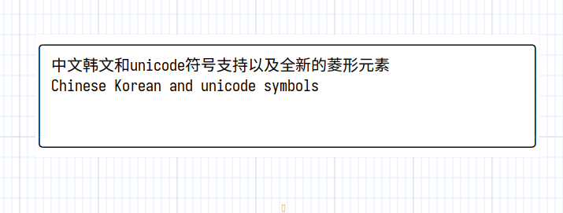
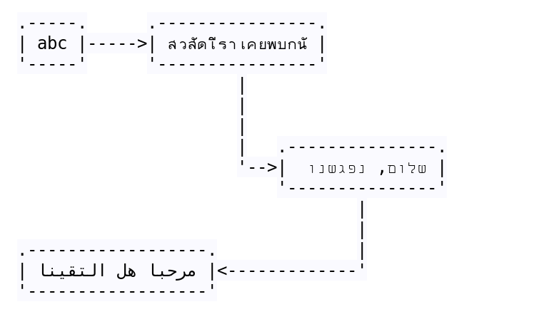

# Unicode support

Asciio supports Unicode is a work under progress; including support for Asian languages, thanks to the co-developer who writes in these languages, but you may need a font that supports them.

https://github.com/be5invis/Sarasa-Gothic/




In the examples above the box is drawn with unicode characters, the box is oversized by design, it shrinks and expands properly.


If you want to align Thai, or Arabic, or Hebrew, under normal circumstances, 
the default monospaced font of the system is fine. If you find that it cannot 
be aligned, you can download a font that can align them.



When displayed in exported software, you also need a font that aligns them.

```txt
      .-----.      .----------------.
      | abc |----->| สวัสดีเราเคยพบกัน |
      '-----'      '----------------'
                            |
                            |
                            |
                            |   .---------------.
                            '-->| שלום, נפגשנו  |
                                '---------------'
                                        |
                                        |
      .------------------.              |
      | مرحبا هل التقينا |<-------------'
      '------------------'

```


