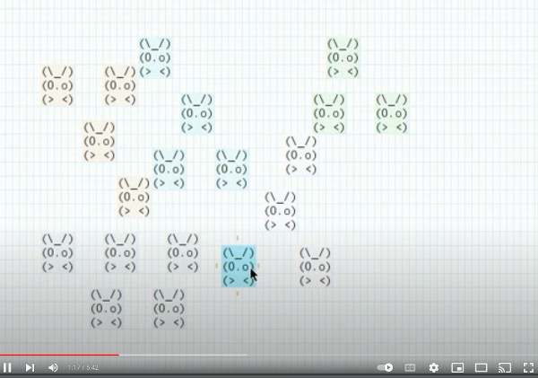

# videos

- presentation

- efficient session

- grouping

- working with external commands

	- input to asciio

	- using Asciio's output

- doing a presentation with Asciio

- writing requirements with Asciio and markdown

An (15 years!) old video that shows some basic usage:

